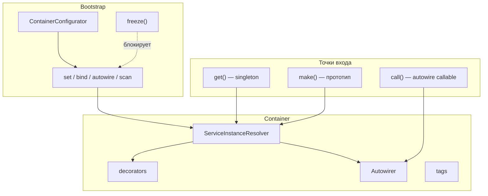

<p align="center">
  <a href="https://github.com/cloudcastle-apps/di">
    
  </a>
</p>

<h1 align="center">CloudCastle DI</h1>

<p align="center">
  <strong>Lightweight PSR-11 dependency injection container for PHP 8.1+</strong><br>
  Лёгкий DI-контейнер: autowiring, конфигурация PHP/JSON/YAML/XML, scan, теги, декораторы.
</p>

<p align="center">
  <a href="https://github.com/cloudcastle-apps/di/wiki/Quick-start">⚡ Quick start</a> ·
  <a href="https://github.com/cloudcastle-apps/di/wiki/Comparison">📊 Сравнение</a> ·
  <a href="https://github.com/cloudcastle-apps/di/wiki">📚 Wiki</a> ·
  <a href="https://packagist.org/packages/cloudcastle/di">Packagist</a> ·
  <a href="https://github.com/cloudcastle-apps/di/releases">Releases</a>
</p>

<p align="center">
  
</p>

[](https://packagist.org/packages/cloudcastle/di)
[](https://packagist.org/packages/cloudcastle/di)
[](https://github.com/cloudcastle-apps/di/stargazers)
[](https://packagist.org/packages/cloudcastle/di)
[](https://packagist.org/packages/cloudcastle/di)
[](https://github.com/cloudcastle-apps/di/actions/workflows/quality.yml)
[](https://github.com/cloudcastle-apps/di/blob/main/CONTRIBUTING.md)
[](https://github.com/cloudcastle-apps/di/discussions)

**English:** Lightweight [PSR-11](https://www.php-fig.org/psr/psr-11/) dependency injection container for PHP 8.1+. Explicit `set()` / `get()` wiring, optional constructor/property/method autowiring, **declarative configuration** (PHP/JSON/YAML/XML), directory scan, **prototypes (`make`)**, **aliases**, **lazy services**, **callable invocation (`call`)**, **interface binding (`bind`)**, **after-resolving hooks**, **custom inject attributes**, tagged services (ids / iterator / locator), decorators, global registry — one runtime dependency (`psr/container`).

**Русский:** Лёгкий контейнер внедрения зависимостей для PHP 8.1+ с поддержкой PSR-11. Явная регистрация сервисов, singleton-фабрики, autowiring конструктора, **свойств** и **методов**, **конфигурация из файлов**, сканирование каталогов, **прототипы**, **alias**, **lazy**, **вызов callable с autowire**, **bind**, **afterResolving**, **пользовательские attributes**, теги, декораторы и глобальный реестр.

---

## 📊 Сравнение с аналогами

| | CloudCastle DI | PHP-DI | Symfony DI | Pimple | Laravel | Nette DI |
|---|:---:|:---:|:---:|:---:|:---:|:---:|
| **Runtime deps** | 1 | неск. | symfony/* | 0 | illuminate/* | nette/* |
| **Autowiring** | ✅ | ✅ | ✅ | ❌ | ✅ | ✅ |
| **Compiled / contextual** | ✅ compiled (v1.9) | ✅ | ✅ | ❌ | ✅ | ✅ |
| **Конфиг YAML/JSON** | ✅ | ✅ | ✅ | ❌ | ✅ | ✅ NEON |

**Полная таблица** (5 аналогов, колонка 🏆 победитель): **[Wiki: Comparison](https://github.com/cloudcastle-apps/di/wiki/Comparison)**

| ✅ Подходит | ❌ Лучше другой |
|-------------|-----------------|
| Composition root, CLI, API, библиотеки | Уже Symfony / Laravel |
| Autowiring без фреймворка | Compiled container (v1.9) |
| Одна зависимость `psr/container` | Legacy PHP &lt; 8.1 |

---

## 🧩 Возможности

<details open>
<summary><strong>Базовый DI · Autowiring · Scan · Config · Tags</strong></summary>

| Категория | Возможности |
|-----------|-------------|
| **Базовый DI** | `set()` / `get()` / `has()`, фабрики, singleton-кэш, PSR-11 |
| **Autowiring** | constructor, property, method; `Inject` / `Autowire`; union, intersection |
| **Scan** | `scan()` — обход каталога, фильтр namespace |
| **Конфиг** | `ContainerConfigurator` — PHP, JSON, YAML, XML; priority; каталоги (v1.7) |
| **Расширения** | `make()`, `alias()`, `lazy()`, `call()`, `bind()`, `afterResolving()` |
| **Теги** | `tag()`, iterator, locator, `decorate()` |
| **Прочее** | `freeze()`, `dump()`, `ContainerRegistry` |
| **Compiled (v1.9)** | `ContainerCompiler` — PHP-класс без reflection на hot path |
| **Contextual (v1.11)** | `Container::when()->needs()->give()` — runtime ([#25](https://github.com/cloudcastle-apps/di/issues/25)) |

</details>

## 🏗️ Как это устроено



Схемы всех потоков — [Wiki: Архитектура](https://github.com/cloudcastle-apps/di/wiki/Architecture).

---

## 📋 Требования

- PHP ^8.1 (CI: 8.1–8.5)
- `psr/container` ^2.0
- Опционально: `ext-yaml` — YAML-конфигурация

## 📦 Установка

```bash
composer require cloudcastle/di:^1.8
```

## ⚡ Быстрый старт

```php
<?php

use CloudCastle\DI\Container;

$container = new Container();
$container->enableAutowiring();
$container->bind(LoggerInterface::class, FileLogger::class);

$service = $container->get(App\Service\UserService::class);
```

Больше примеров — [Wiki: Quick start](https://github.com/cloudcastle-apps/di/wiki/Quick-start) · [Bootstrap](https://github.com/cloudcastle-apps/di/wiki/Bootstrap).

<details>
<summary><strong>Примеры: явная регистрация, autowiring, scan, теги, конфиг</strong></summary>

### Явная регистрация

```php
$container = new Container();
$container->set('logger', new Psr\Log\NullLogger());
$container->set(
    'repository',
    static fn (Container $c) => new UserRepository($c->get('logger')),
);
```

### Autowiring + attributes

```php
$container->enableAutowiring();
$container->enableParameterNameAutowiring();
$userService = $container->get(App\Service\UserService::class);
```

### Scan, bind, call, tags

```php
$container->scan(__DIR__ . '/Services', 'App\\Services\\');
$container->bind(LoggerInterface::class, FileLogger::class);
$container->call(static fn (LoggerInterface $log) => $log->info('ok'));
$container->tag('handler.email', 'handlers');
```

### Конфигурация из файлов

```php
use CloudCastle\DI\Configuration\ContainerConfigurator;

(new ContainerConfigurator())->configure($container, [
    __DIR__ . '/config/services.php',
]);
$container->freeze();
```

</details>

## 📚 Документация

| Раздел | Ссылка |
|--------|--------|
| 📚 Wiki — главная | [Home](https://github.com/cloudcastle-apps/di/wiki/Home) |
| 📊 Сравнение (таблица) | [Comparison](https://github.com/cloudcastle-apps/di/wiki/Comparison) |
| ⚡ Быстрый старт | [Quick-start](https://github.com/cloudcastle-apps/di/wiki/Quick-start) |
| 🏗️ Архитектура | [Architecture](https://github.com/cloudcastle-apps/di/wiki/Architecture) |
| 📄 Конфигурация | [Configuration](https://github.com/cloudcastle-apps/di/wiki/Configuration) |
| 📖 Справочник конфига | [Configuration-reference](https://github.com/cloudcastle-apps/di/wiki/Configuration-reference) |
| 📋 API | [API-reference](https://github.com/cloudcastle-apps/di/wiki/API-reference) |
| 🚀 Compiled container | [Compiled-container](https://github.com/cloudcastle-apps/di/wiki/Compiled-container) |
| 🔗 Contextual binding | [Contextual-binding](https://github.com/cloudcastle-apps/di/wiki/Contextual-binding) |

Исходники Wiki — каталог [`wiki/`](wiki/Home). API после `composer docs` → `docs/`.

## 🧪 Качество

```bash
composer install
composer ci
```

| | |
|---|---|
| **Тесты** | 614 PHPUnit (unit 562, integration 8, security 17, load 15, performance 12) |
| **Статика** | PHPStan max, Psalm L1, Rector |
| **Coverage** | 100% line coverage `src/`, per-file ≥95%, Infection MSI ≥94% |
| **CI** | PHP 8.1–8.5, benchmark-check, CodeQL |

[Wiki: Testing](https://github.com/cloudcastle-apps/di/wiki/Testing) · [Performance-and-load](https://github.com/cloudcastle-apps/di/wiki/Performance-and-load)

## 💬 Сообщество

- [Discussions](https://github.com/cloudcastle-apps/di/discussions) — вопросы и идеи
- [Issues](https://github.com/cloudcastle-apps/di/issues) — баги и задачи

## 📜 Лицензия

[MIT](LICENSE)
