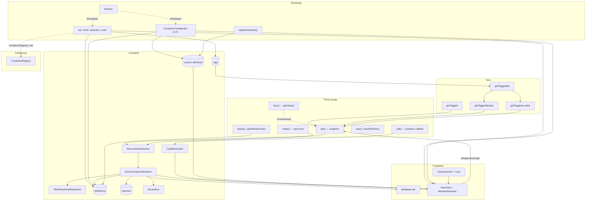

<p align="center">
  <a href="https://github.com/cloudcastle-apps/di">
    
  </a>
</p>

<h1 align="center">CloudCastle DI</h1>

<p align="center">
  <strong>Lightweight PSR-11 dependency injection container for PHP 8.3+</strong><br>
  Лёгкий DI-контейнер: autowiring, конфигурация PHP/JSON/YAML/XML, scan, теги, декораторы.
</p>

<p align="center">
  <a href="https://github.com/cloudcastle-apps/di/wiki/Quick-start">Quick start</a> ·
  <a href="https://github.com/cloudcastle-apps/di/wiki/Comparison">Сравнение (пошагово)</a> ·
  <a href="https://github.com/cloudcastle-apps/di/wiki">Wiki</a> ·
  <a href="https://packagist.org/packages/cloudcastle/di">Packagist</a> ·
  <a href="https://github.com/cloudcastle-apps/di/releases">Releases</a>
</p>

**English:** Lightweight [PSR-11](https://www.php-fig.org/psr/psr-11/) dependency injection container for PHP 8.3+. Explicit `set()` / `get()` wiring, optional constructor/property/method autowiring, **declarative configuration** (PHP/JSON/YAML/XML), directory scan, **prototypes (`make`)**, **aliases**, **lazy services**, **callable invocation (`call`)**, **interface binding (`bind`)**, **after-resolving hooks**, **custom inject attributes**, tagged services (ids / iterator / locator), decorators, global registry — one runtime dependency (`psr/container`).

**Русский:** Лёгкий контейнер внедрения зависимостей для PHP 8.3+ с поддержкой PSR-11. Явная регистрация сервисов, singleton-фабрики, autowiring конструктора, **свойств** и **методов**, **конфигурация из файлов**, сканирование каталогов, **прототипы**, **alias**, **lazy**, **вызов callable с autowire**, **bind**, **afterResolving**, **пользовательские attributes**, теги, декораторы и глобальный реестр.

[](https://packagist.org/packages/cloudcastle/di)
[](https://packagist.org/packages/cloudcastle/di)
[](https://github.com/cloudcastle-apps/di/stargazers)
[](https://packagist.org/packages/cloudcastle/di)
[](https://packagist.org/packages/cloudcastle/di)
[](https://github.com/cloudcastle-apps/di/actions/workflows/quality.yml)
[](https://github.com/cloudcastle-apps/di/blob/main/CONTRIBUTING.md)
[](https://github.com/cloudcastle-apps/di/discussions)

## Сравнение с аналогами

**Плюсы:** одна зависимость (`psr/container`), PSR-11 + autowiring, явный PHP bootstrap или декларативная конфигурация (PHP/JSON/YAML/XML), теги и декораторы — без полноценного DI-фреймворка.

**Минусы:** нет compiled container и contextual binding (v2), только PHP 8.3+, меньше community чем у PHP-DI/Symfony.

**Пошаговое сравнение** (PHP-DI, Symfony DI, Pimple, Laravel) с таблицами по каждому критерию — [Wiki: Comparison](https://github.com/cloudcastle-apps/di/wiki/Comparison). Кратко в `doc/guide/comparison.rst` после `composer docs`.

Подходит для **composition root** в библиотеках, CLI, API и тестах. Если уже **Symfony** или **Laravel** — используйте встроенный DI. Нужен **compiler** или **contextual binding** сейчас — **PHP-DI** или **Symfony DI**. До ~10 сервисов без autowiring — **Pimple**.

## Как это устроено



Полный набор схем (bootstrap, autowiring, configuration, freeze, типы параметров, циклы, теги) — в [Wiki: Архитектура](https://github.com/cloudcastle-apps/di/wiki/Architecture).

## Возможности

### Базовый DI

- Регистрация сервисов как готовых экземпляров или фабрик
- Singleton-поведение: фабрика вызывается один раз, результат кэшируется
- Передача контейнера в фабрику для разрешения зависимостей
- Соответствие PSR-11 (`Psr\Container\ContainerInterface`)

### Autowiring и сканирование

Порядок внедрения при autowiring: **конструктор → свойства → методы**.

- **`enableAutowiring()`** — создание классов по FQCN при `get()` без явного `set()`
- **`autowire(string $className)`** — точечная регистрация класса (id = полное имя класса)
- **`enableParameterNameAutowiring()`** — параметр `$logger` → сервис с id `'logger'` (по умолчанию выключен)
- **`enablePropertyAutowiring()`** / **`enableMethodAutowiring()`** — typed properties и inject-методы/setter после конструктора
- **`scan(string $directory, ?string $namespace = null)`** — обход каталога и autowiring найденных instantiable-классов (несколько `class` в одном файле; `enum` парсятся, но не регистрируются)
- PHP attributes **`Inject`** / **`Autowire`** на конструкторе, **свойствах** и **методах** (attributes работают без флагов property/method)
- **`registerAttribute()`** — пользовательские attributes (`ServiceIdAttribute`)
- Разрешение по типам: union, **intersection**, nullable, `ContainerInterface` / PSR-11
- Обнаружение циклических зависимостей при autowiring
- Явный `set()` всегда имеет **приоритет** над autowiring

### Расширения контракта

- **`make(string $id)`** — новый экземпляр без singleton-кэша (прототип)
- **`alias(string $alias, string $targetId)`** — альтернативный id для того же сервиса
- **`lazy(string $serviceId)`** — обёртка `LazyService` с отложенным `get()`
- **`call(callable, array $parameters = [])`** — вызов функции/метода с autowiring параметров
- **`bind(string $abstract, string $concrete)`** — привязка интерфейса к классу или id
- **`addDefinitions(array $definitions)`** — массовый `set()`
- **`afterResolving(string $id, callable $callback)`** — callback после создания сервиса
- **`tag()` / `getTagged()` / `getTaggedIds()` / `getTaggedIterator()` / `getTaggedLocator()`** — группы сервисов по тегам
- **`decorate()`** — цепочка декораторов при `get()` / `make()`
- **`hasDefinition()`** — проверка регистрации без создания экземпляра

### Конфигурация из файлов (v1.5)

- **`ContainerConfigurator`** — опциональный сервис: PHP (по умолчанию), JSON, YAML, XML
- Несколько источников, слияние с приоритетами (последний побеждает, если не задан `priority`)
- Секции: `services`, `bind`, `aliases`, `autowire`, `tags`, `scan`, `register_attributes`, `autowiring`
- См. [Wiki: Configuration](https://github.com/cloudcastle-apps/di/wiki/Configuration)

### Заморозка и интроспекция (v1.4)

- **`freeze()`** / **`isFrozen()`** — блокировка изменений после bootstrap
- **`getDefinitionIds()`**, **`dump()`** — отладка wiring

### Глобальный реестр

- **`ContainerRegistry::set()` / `get()` / `has()` / `reset()`** — singleton-контейнер приложения (инициализация в точке входа, `reset()` для тестов)

### Качество

- Строгая типизация, PHPStan max, Psalm level 1, покрытие строк ≥95% (фактически ~98%)
- CI: PHP 8.3, 8.4, 8.5; CodeQL; **benchmark regression check**
- **470 PHPUnit-тестов:** unit (421), integration (5), security (17), load (15), performance (12)
- Infection MSI ≥95% по всему `src/` (включая `Configuration/`)

Подробнее — [Wiki: тестирование](https://github.com/cloudcastle-apps/di/wiki/Testing) · [нагрузка и производительность](https://github.com/cloudcastle-apps/di/wiki/Performance-and-load).

## Требования

- PHP ^8.3
- `psr/container` ^2.0
- Опционально: `ext-yaml` — для YAML-конфигурации (`ContainerConfigurator`)

## Установка

```bash
composer require cloudcastle/di:^1.6
```

## Быстрый старт

### Явная регистрация

```php
<?php

use CloudCastle\DI\Container;

$container = new Container();

$container->set('logger', new Psr\Log\NullLogger());
$container->set(
    'repository',
    static fn (Container $c) => new UserRepository($c->get('logger')),
);

$logger = $container->get('logger');
$repository = $container->get('repository');
```

### Autowiring конструктора

```php
use CloudCastle\DI\Attribute\Inject;
use CloudCastle\DI\Container;

$container = new Container();
$container->set('app.clock', $clock);
$container->enableAutowiring();
$container->enableParameterNameAutowiring(); // опционально: $logger → id 'logger'

// Классы создаются по типам конструктора; id = FQCN
// #[Inject('app.clock')] на параметрах — явный id
$userService = $container->get(App\Service\UserService::class);
```

### Property и method injection

```php
use CloudCastle\DI\Attribute\Inject;
use CloudCastle\DI\Container;

$container = new Container();
$container->set(LoggerInterface::class, $logger);
$container->enableAutowiring();
$container->enablePropertyAutowiring(); // typed properties без attribute
$container->enableMethodAutowiring();   // setter без attribute

// #[Inject] на свойстве или inject-методе — без enableProperty/MethodAutowiring
$service = $container->get(App\Service\ReportService::class);
```

### Сканирование каталога

```php
$container->scan(__DIR__ . '/Services', 'App\\Services\\');
// Каждый instantiable-класс в каталоге регистрируется через autowire()
// Существующие set() не перезаписываются
```

### Прототипы, alias и lazy

```php
// Прототип: новый объект при каждом вызове
$container->set('job', static fn () => new Job());
$jobA = $container->make('job');
$jobB = $container->make('job'); // !== $jobA

// Alias: интерфейс → конкретная регистрация
$container->set('app.clock', $clock);
$container->alias(ClockInterface::class, 'app.clock');

// Lazy: создание при первом getValue()
$container->set('reports', $container->lazy(ReportGenerator::class));
$lazy = $container->get('reports');
$generator = $lazy->getValue();
```

### call(), bind(), afterResolving и теги (v1.3)

```php
$container->enableAutowiring();

// bind: интерфейс → реализация (autowire + alias)
$container->bind(LoggerInterface::class, FileLogger::class);

// Массовая регистрация
$container->addDefinitions([
    'config' => $config,
    'logger' => static fn () => new FileLogger(),
]);

// Вызов с autowiring (closure, метод, функция)
$container->call(static fn (LoggerInterface $log) => $log->info('ok'));

// Callback только при новом создании (не из singleton-кэша)
$container->afterResolving(UserRepository::class, static function ($id, $instance, $c): void {
    // аудит, warmup, …
});

// Теги: id без get(), только значения, или locator по id
$container->tag('handler.email', 'handlers');
$ids = $container->getTaggedIds('handlers');
foreach ($container->getTaggedIterator('handlers') as $handler) { /* … */ }
$locator = $container->getTaggedLocator('handlers');
```

### Глобальный контейнер

```php
use CloudCastle\DI\Container;
use CloudCastle\DI\ContainerRegistry;

$container = new Container();
$container->enableAutowiring();
ContainerRegistry::set($container);

$mailer = ContainerRegistry::get()->get(App\Mailer::class);
```

### Конфигурация из файлов (v1.5)

```php
use CloudCastle\DI\Configuration\ContainerConfigurator;
use CloudCastle\DI\Container;

$container = new Container();
(new ContainerConfigurator())->configure($container, [
    __DIR__ . '/config/services.php',
    __DIR__ . '/config/prod.json',
]);
$container->freeze();
```

## API (кратко)

| Метод | Описание |
|-------|----------|
| `get(string $id): mixed` | Сервис из кэша, `set()`, autowiring или `NotFoundException` |
| `make(string $id): mixed` | Новый экземпляр без singleton-кэша |
| `alias(string $alias, string $targetId): void` | Привязка альтернативного id |
| `lazy(string $serviceId): LazyService` | Отложенное разрешение сервиса |
| `call(callable $callable, array $parameters = []): mixed` | Вызов с autowiring параметров |
| `bind(string $abstract, string $concrete): void` | Привязка абстракции к классу или id |
| `addDefinitions(array $definitions): void` | Массовый `set()` |
| `afterResolving(string $id, callable $callback): void` | Callback после **нового** создания (не из кэша); каждый `make()` — снова |
| `has(string $id): bool` | Доступен ли сервис (включая autowiring и alias) |
| `set(string $id, mixed $concrete): void` | Экземпляр или фабрика; сбрасывает singleton-кэш |
| `hasDefinition(string $id): bool` | Есть `set()` или `autowire()` без создания |
| `tag()` / `getTagged()` / `getTaggedIds()` / `getTaggedIterator()` / `getTaggedLocator()` | Группы сервисов по тегам |
| `decorate()` | Обёртки при `get()` |
| `enableAutowiring()` / `disableAutowiring()` / `isAutowiringEnabled()` | Глобальный autowiring |
| `enableParameterNameAutowiring()` / `disableParameterNameAutowiring()` | Autowiring по имени параметра |
| `enablePropertyAutowiring()` / `disablePropertyAutowiring()` | Autowiring typed properties |
| `enableMethodAutowiring()` / `disableMethodAutowiring()` | Autowiring inject-методов и setter |
| `autowire(string $className): void` | Явная регистрация класса |
| `scan(string $directory, ?string $namespace): void` | Autowiring классов из каталога |
| `registerAttribute(string $attributeClass): void` | Пользовательский `ServiceIdAttribute` |
| `freeze()` / `isFrozen()` / `getDefinitionIds()` / `dump()` | Заморозка и интроспекция (v1.4) |

Подробнее — [Wiki](https://github.com/cloudcastle-apps/di/wiki/Home) ( [Configuration](https://github.com/cloudcastle-apps/di/wiki/Configuration) · [Autowiring](https://github.com/cloudcastle-apps/di/wiki/Autowiring) · [API](https://github.com/cloudcastle-apps/di/wiki/API-reference) · [call(), bind(), afterResolving](https://github.com/cloudcastle-apps/di/wiki/Call-bind-callbacks) · [Прототипы, alias и lazy](https://github.com/cloudcastle-apps/di/wiki/Prototypes-alias-lazy) · [Bootstrap](https://github.com/cloudcastle-apps/di/wiki/Bootstrap) ) и `doc/guide/` после `composer docs`.

## Сообщество

- [GitHub Discussions](https://github.com/cloudcastle-apps/di/discussions) — вопросы, идеи, примеры
- [Issues](https://github.com/cloudcastle-apps/di/issues) — баги и задачи

## Документация

- [Wiki — главная](https://github.com/cloudcastle-apps/di/wiki/Home) · [**сравнение с PHP-DI / Symfony / Pimple**](https://github.com/cloudcastle-apps/di/wiki/Comparison) · [архитектура](https://github.com/cloudcastle-apps/di/wiki/Architecture) · [быстрый старт](https://github.com/cloudcastle-apps/di/wiki/Quick-start) · [autowiring](https://github.com/cloudcastle-apps/di/wiki/Autowiring) · [call(), bind(), afterResolving](https://github.com/cloudcastle-apps/di/wiki/Call-bind-callbacks) · [прототипы, alias и lazy](https://github.com/cloudcastle-apps/di/wiki/Prototypes-alias-lazy) · [теги и декораторы](https://github.com/cloudcastle-apps/di/wiki/Tags-and-decorators) · [примеры bootstrap](https://github.com/cloudcastle-apps/di/wiki/Bootstrap) · [API](https://github.com/cloudcastle-apps/di/wiki/API-reference)
- Исходники Wiki в каталоге [`wiki/`](wiki/Home) (внутренние ссылки **без** суффикса `.md`)
- [Поддержка](SUPPORT.md) — куда обратиться за помощью
- [Руководство для разработчиков](CONTRIBUTING.md) — окружение, тесты, CI
- [История изменений](CHANGELOG.md) · [Обновление версий](UPGRADING.md)
- API-документация: `composer docs` → каталог `docs/`

## Качество

```bash
composer install
composer ci
composer benchmark-report    # фактические времена бенчмарков (markdown)
composer benchmark-check       # проверка регрессии (×1.5, как в CI)
```

Пайплайн: линтеры, PHPStan (max), Psalm (L1), PHPMD, Deptrac, Rector, **470 PHPUnit-тестов**, покрытие строк ≥95%, Infection MSI ≥95%, **benchmark-check**

| Набор | Тестов | Документация |
|-------|--------|--------------|
| unit | 421 | [Wiki: Testing](https://github.com/cloudcastle-apps/di/wiki/Testing) |
| integration | 5 | — |
| security | 17 | [Wiki: Security-tests](https://github.com/cloudcastle-apps/di/wiki/Security-tests) |
| load | 15 | [Wiki: Performance-and-load](https://github.com/cloudcastle-apps/di/wiki/Performance-and-load) |
| performance | 12 | — |

**Подробно:** security — freeze, кэш при ошибках, autowiring; load — 1000–3000 ops; performance — hot path до 10 000 итераций. Кратко в `doc/guide/load-performance.rst`.

## Лицензия

Распространяется под [лицензией MIT](LICENSE).
