<p align="center">
  
</p>

# 🏗️ Архитектура и принцип работы

> [← Главная](Home) · [Сравнение](Comparison) · [Autowiring](Autowiring)

На этой странице — схемы жизненного цикла сервисов, autowiring, конфигурации, заморозки, сканирования и вспомогательных механизмов пакета **cloudcastle/di**.

## Обзор компонентов

Публичная точка входа — `Container`. Внутренние классы не предназначены для прямого использования в приложении, но формируют чёткое разделение ответственности.

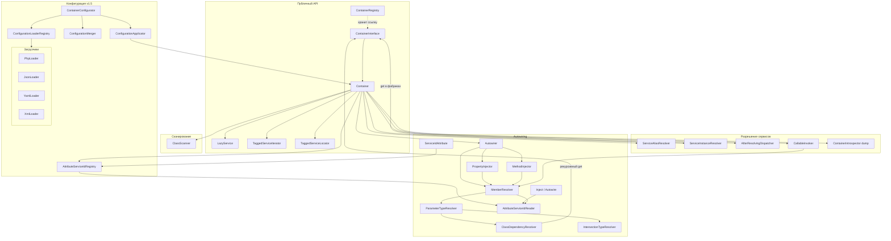

| Компонент | Роль |
|-----------|------|
| `Container` | Регистрация (`set`, `autowire`, `tag`, `decorate`, `alias`, `bind`, `addDefinitions`, `registerAttribute`), `call()`, `afterResolving()`, флаги autowiring, `freeze()` / `dump()`, делегирование resolve |
| `ContainerIntrospector` | Снимок wiring для `dump()` / `getDefinitionIds()` |
| `ServiceAliasResolver` | Цепочки `alias → targetId`, детекция циклов |
| `ServiceInstanceResolver` | Кэш, definitions, autowiring, декораторы; общий для `get()` и `make()` |
| `AfterResolvingDispatcher` | Callback после нового resolve |
| `CallableInvoker` | Autowiring вызова callable |
| `TaggedServiceIterator` / `TaggedServiceLocator` | Итерация и доступ к сервисам по тегу |
| `Autowirer` | `new` + property + method injection |
| `ClassScanner` | Парсинг PHP-файлов без выполнения, список FQCN |
| `ContainerConfigurator` | Загрузка конфигурации из PHP/JSON/YAML/XML, слияние по приоритетам, `apply()` к контейнеру |
| `AttributeServiceIdRegistry` | Пользовательские PHP-attributes для autowiring (`registerAttribute()`) |
| `LazyService` | Отложенный `get()` при первом `getValue()` |
| `LazyGhostProxyFactory` | Lazy ghost/proxy для interface (v1.18, opt-in var-exporter) |
| `ContainerProfiler` | Opt-in замеры get/make/call (v1.15) |
| `ServiceObjectPool` | Object pool для `make()` (v1.16) |
| `ServiceTtlRegistry` | TTL singleton-кэша (v1.17) |
| `ContainerRegistry` | Глобальный singleton-контейнер приложения |

---

## Жизненный цикл приложения (bootstrap)

Типичный composition root: один контейнер на запрос (PHP-FPM) или на worker.

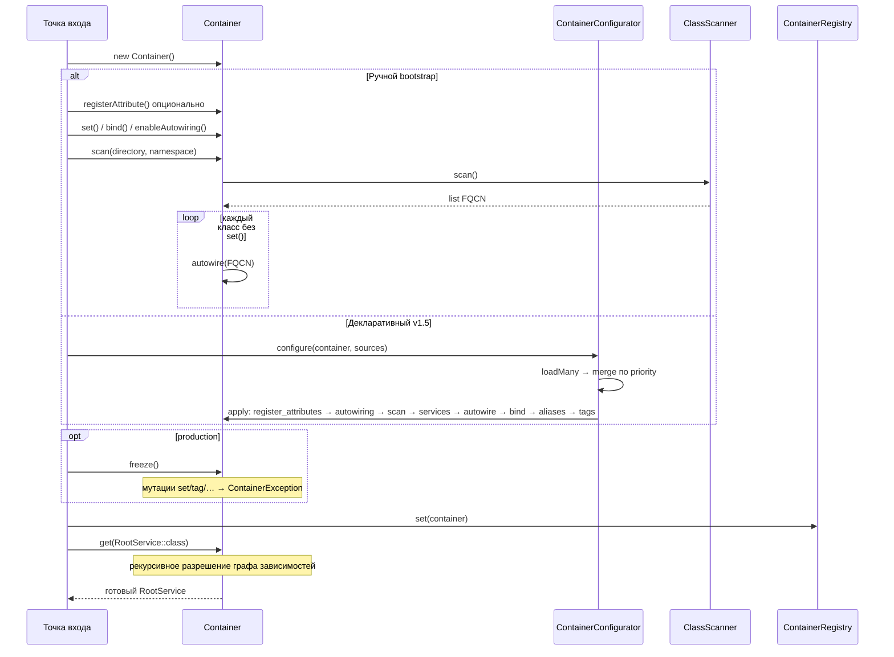

**Приоритет регистрации:** явный `set(id)` всегда сильнее autowiring для того же `id`. `scan()` не перезаписывает существующие `set()`.

**Альтернатива (v1.5):** вместо ручного `set()` / `scan()` — `ContainerConfigurator::configure($container, …)` с одним или несколькими файлами (PHP, JSON, YAML, XML). Слои с большим `priority` перекрывают предыдущие. См. [Конфигурация из файлов](Configuration).

---

## `get()` и `make()`: общий путь разрешения

Оба метода сначала разрешают alias, затем вызывают `ServiceInstanceResolver` с флагом singleton.

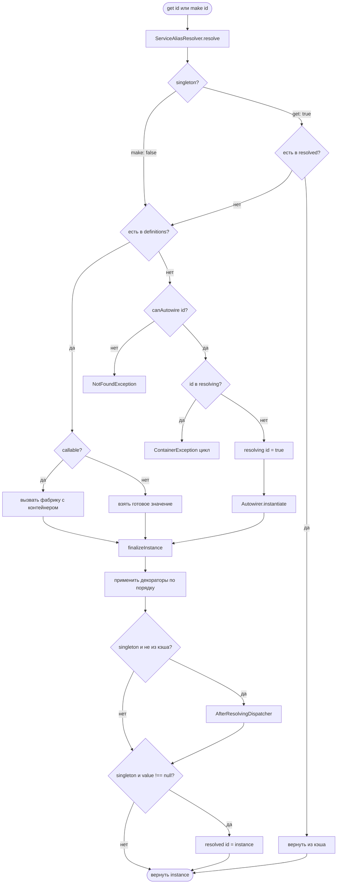

| | `get()` | `make()` |
|---|---------|----------|
| Читает `resolved` | да | нет |
| Пишет в `resolved` | да (если не `null`) | нет |
| Фабрика | один раз до `set`/`decorate` | каждый вызов |
| Autowiring | кэшируется | новый объект |
| Декораторы | да | да |

---

## Autowiring: создание объекта

`Autowirer::instantiate()` — единственная точка создания классов через reflection.

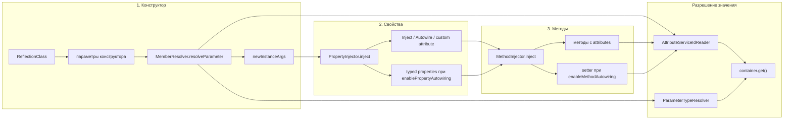

При autowiring зависимости конструктора снова вызывают `$container->get()` — поэтому возможны цепочки и циклы (отслеживаются в `resolving`).

---

## Разрешение одного параметра / свойства

`MemberResolver` задаёт **фиксированный порядок** для конструктора, свойств и методов.

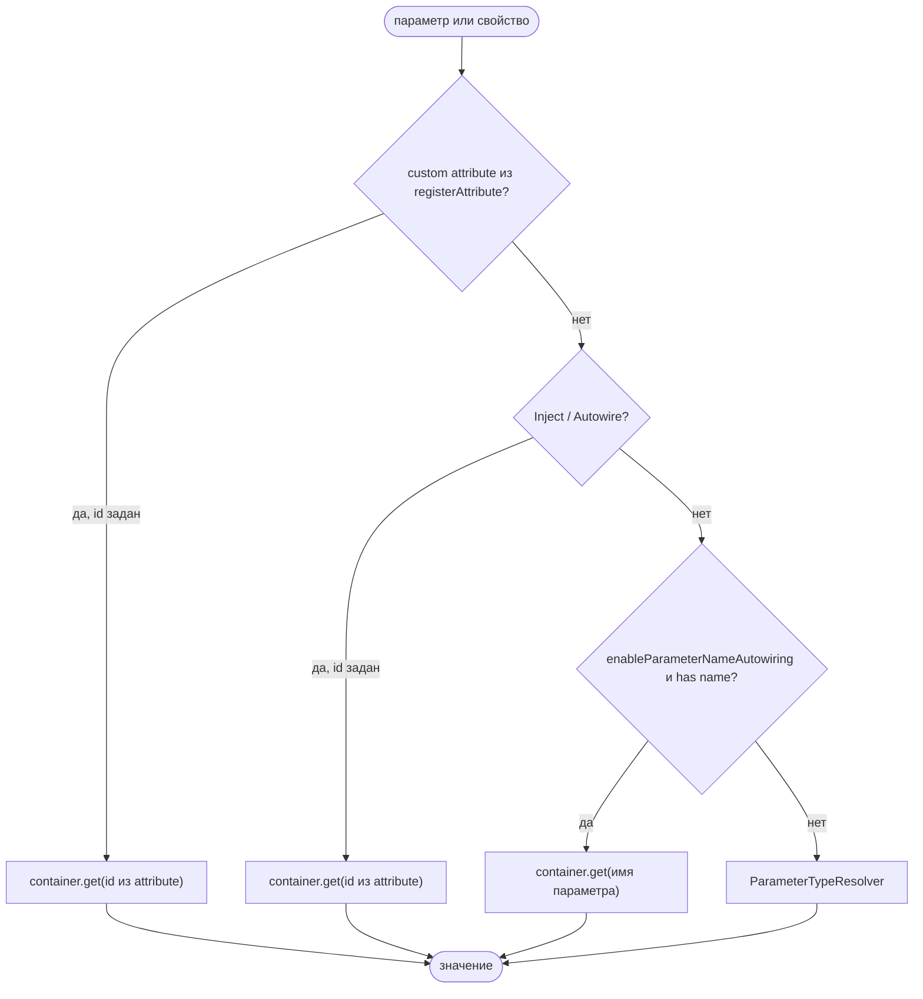

### Разрешение по типу (`ParameterTypeResolver`)


Особые случаи:

- `ContainerInterface` / `Psr\Container\ContainerInterface` → текущий контейнер
- Intersection `A&B` → сервис, проходящий проверку всех интерфейсов
- Union → первый подходящий не-builtin тип с `has()`

---

## Циклические зависимости

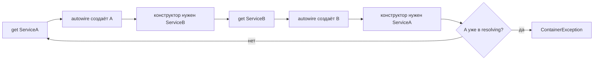

Стек `resolving` очищается в `finally` после успеха или ошибки instantiate.

**Важно:** циклы в **фабриках** `set()` не отслеживаются — возможен бесконечный рекурсивный `get()`.

---

## Alias

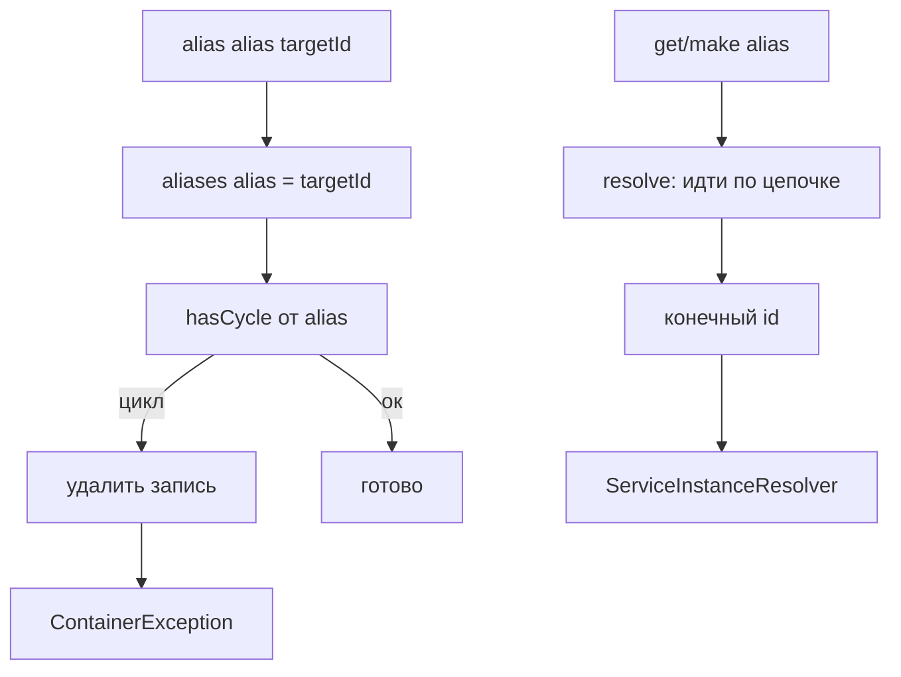

`has()` возвращает `true` для id, зарегистрированного как alias, даже если target ещё не создан.

### `bind()` vs `alias()`

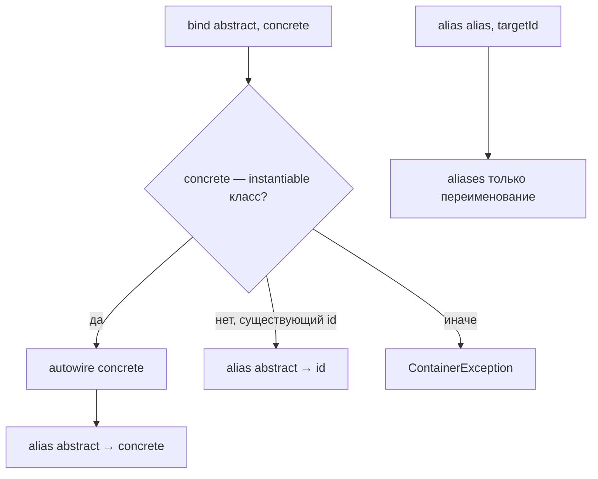

---

## Lazy-сервис

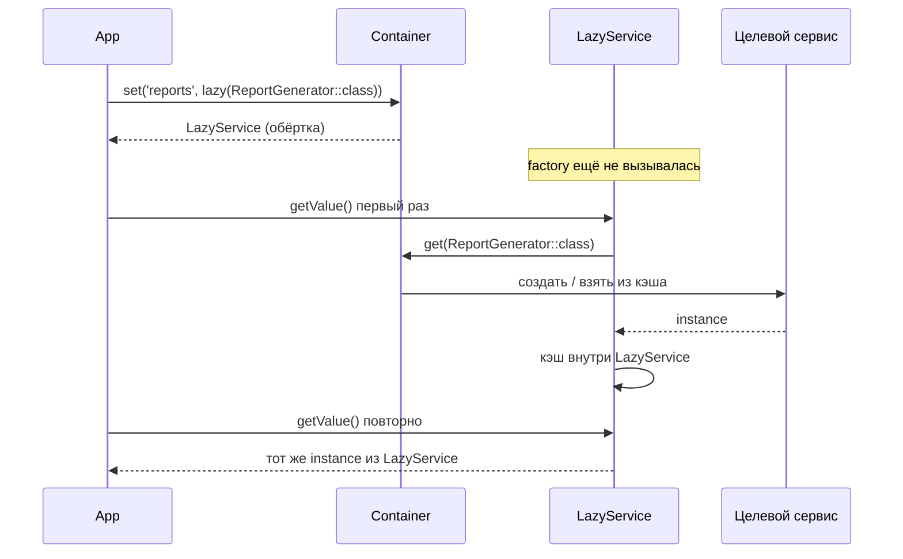

Singleton-кэш контейнера для целевого id заполняется при **первом** `get()` внутри `LazyService`, не при `set(lazy(...))`.

---

## Декораторы

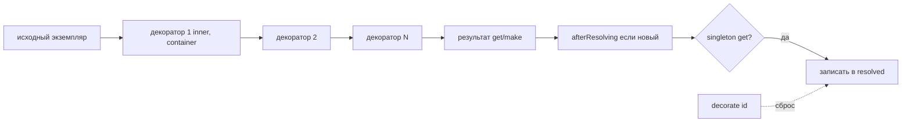

`decorate(id)` сбрасывает `resolved[id]`. Порядок: первый зарегистрированный декоратор ближе к inner.

---

## Tagged services

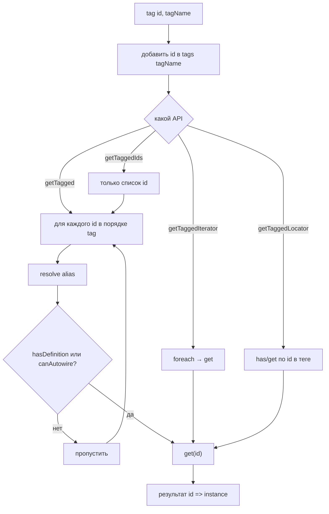

Ключ в результате — **исходный** id из `tag()`, значение — после полного `get()` (с alias и декораторами).

---

## Сканирование каталога (`scan`)

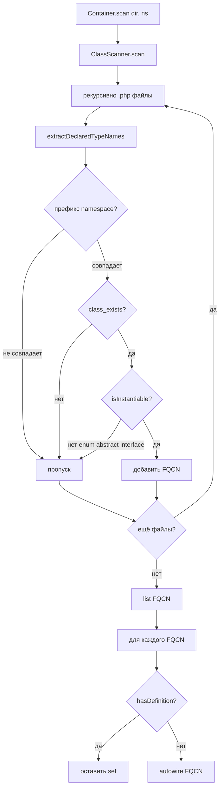

Парсинг **не выполняет** PHP-код файла; `class_exists()` загружает класс через Composer autoload.

---

## Хранилища состояния контейнера

```mermaid
erDiagram
    CONTAINER ||--o{ DEFINITIONS : "set() addDefinitions"
    CONTAINER ||--o{ RESOLVED : "get() singleton"
    CONTAINER ||--o{ TAGS : "tag()"
    CONTAINER ||--o{ DECORATORS : "decorate()"
    CONTAINER ||--o{ AUTOWIRED : "autowire()"
    CONTAINER ||--o{ RESOLVING : "autowire в процессе"
    CONTAINER ||--o{ AFTER_RESOLVING : "afterResolving()"
    CONTAINER ||--o{ CUSTOM_ATTRIBUTES : "registerAttribute()"
    CONTAINER ||--|| ALIAS_RESOLVER : "alias() bind()"
    CONTAINER ||--|| FLAGS : "autowiring flags"
    CONTAINER ||--|| FROZEN : "freeze()"

    DEFINITIONS {
        string id PK
        mixed concrete "экземпляр или callable"
    }
    RESOLVED {
        string id PK
        object instance "singleton-кэш"
    }
    TAGS {
        string tag PK
        list ids "порядок регистрации"
    }
    DECORATORS {
        string id PK
        list callables "цепочка обёрток"
    }
    AUTOWIRED {
        string fqcn PK
        bool flag
    }
    AFTER_RESOLVING {
        string id PK
        list callbacks "порядок регистрации"
    }
    CUSTOM_ATTRIBUTES {
        string attributeClass PK
    }
    FLAGS {
        bool autowiringEnabled
        bool parameterName
        bool property
        bool method
    }
    FROZEN {
        bool isFrozen
    }
```

---

## Сравнение путей регистрации и получения

```mermaid
flowchart TB
    subgraph register [Регистрация]
        S1[set id, value]
        S2[autowire FQCN]
        S3[scan directory]
        S4[alias a, b]
        S5[bind abstract, concrete]
        S6[addDefinitions array]
        S7[enableAutowiring flags]
        S8[registerAttribute class]
        S9[ContainerConfigurator.configure]
        S10[tag / decorate / afterResolving]
        S11[freeze]
    end

    subgraph obtain [Получение]
        G1[get id]
        G2[make id]
        G3[lazy id → getValue]
        G4[getTagged tag]
        G5[getTaggedIds / Iterator / Locator]
        G6[call callable]
        G7[has / hasDefinition]
        G8[dump / getDefinitionIds]
    end

    S1 --> definitions[(definitions)]
    S2 --> autowired[(autowired)]
    S3 --> autowired
    S4 --> aliases[(aliases)]
    S5 --> aliases
    S5 --> autowired
    S6 --> definitions
    S7 --> flag[autowiring flags]
    S8 --> attrReg[(custom attributes)]
    S9 --> CA[ConfigurationApplicator]
    CA --> definitions
    CA --> autowired
    CA --> aliases
    CA --> flag
    CA --> attrReg
    S10 --> tags[(tags)]
    S10 --> deco[(decorators)]
    S10 --> hooks[(afterResolving)]
    S11 --> frozen[frozen=true]

    G1 --> resolve[ServiceInstanceResolver singleton=true]
    G2 --> resolve2[ServiceInstanceResolver singleton=false]
    G3 --> lazy[LazyService → get]
    G4 --> G1
    G5 --> G1
    G6 --> invoker[CallableInvoker]
    G8 --> introspect[ContainerIntrospector]

    definitions --> resolve
    definitions --> resolve2
    autowired --> resolve
    autowired --> resolve2
    flag --> resolve
    flag --> resolve2
    aliases --> resolve
    aliases --> resolve2
    attrReg --> invoker
    attrReg --> resolve
    deco --> resolve
    deco --> resolve2
    hooks --> resolve
    invoker --> autowired
    frozen -.->|блокирует| register
```

---

## `Container::call()` и `CallableInvoker`

Вызов callable не проходит через `ServiceInstanceResolver` — отдельный путь через `CallableInvoker` и общий `MemberResolver` / `ParameterTypeResolver`.

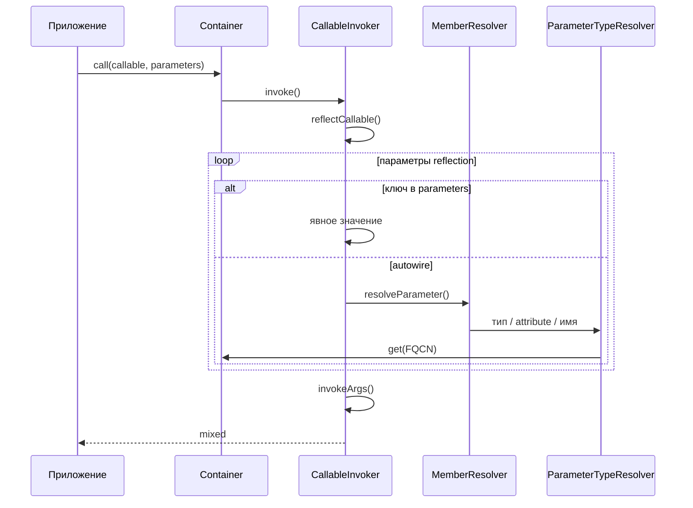

Поддерживаемые формы: `Closure`, first-class callable, `[object, method]`, invokable, имя функции. Подробнее — [call(), bind(), afterResolving](Call-bind-callbacks).

---

## `afterResolving` и `AfterResolvingDispatcher`

Callback регистрируется в `AfterResolvingDispatcher` и вызывается из `Container::resolveService()` **после** успешного создания, если экземпляр не был прочитан из singleton-кэша до resolve.

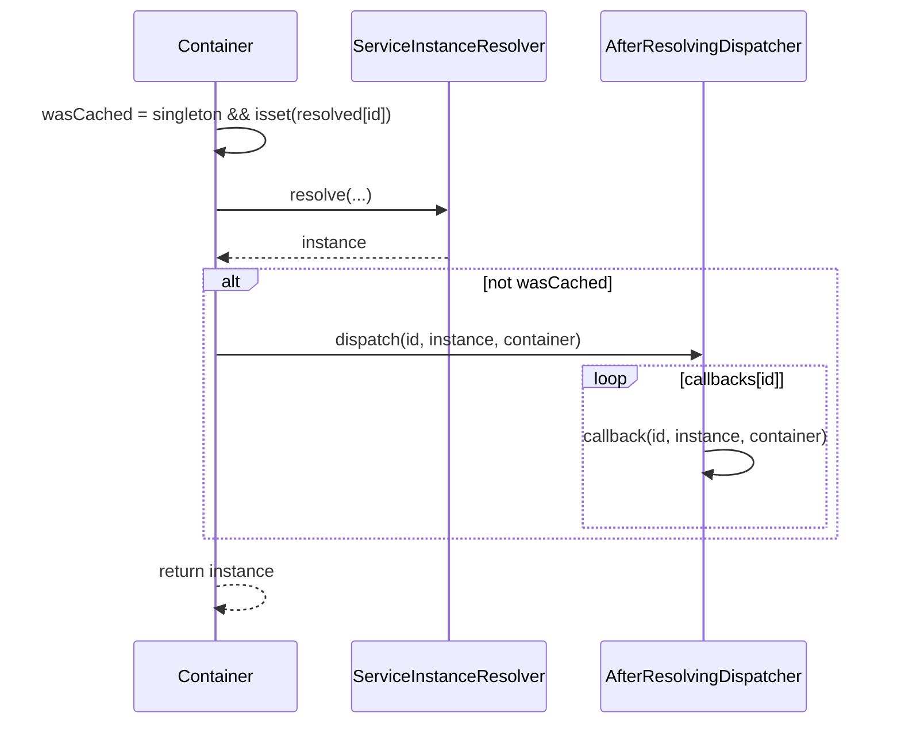

| `get()` | `make()` |
|---------|----------|
| callback при первом создании | callback при **каждом** вызове |
| повторный `get()` из кэша — без callback | всегда новый экземпляр → всегда callback |

---

## Сравнение API тегов

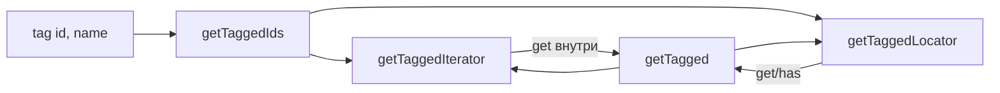

| API | Ключи | Eager `get()` |
|-----|-------|---------------|
| `getTagged()` | id → instance | все id тега |
| `getTaggedIds()` | — | нет |
| `getTaggedIterator()` | только values | при foreach |
| `getTaggedLocator()` | id при iterate | при `get()` / foreach |

---

## Конфигурация: загрузка, слияние, применение (v1.5)

`ContainerConfigurator` не заменяет контейнер — он **наполняет** уже созданный `Container` через `ConfigurationApplicator`.

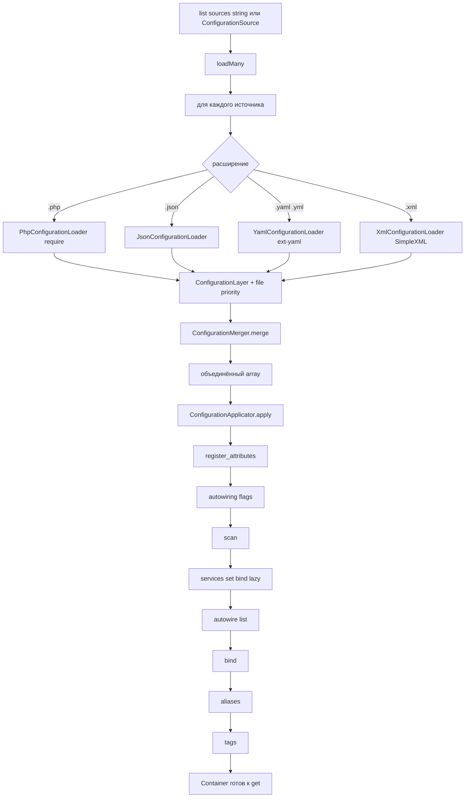

Приоритет при конфликте: **priority параметра** → **priority файла** → **порядок в списке** (последний побеждает).

---

## Заморозка контейнера (`freeze`)

После `freeze()` любая мутация wiring (`set`, `autowire`, `tag`, `bind`, `configure` через applicator и т.д.) выбрасывает `ContainerException`. `get()` / `make()` / `call()` / `has()` продолжают работать.

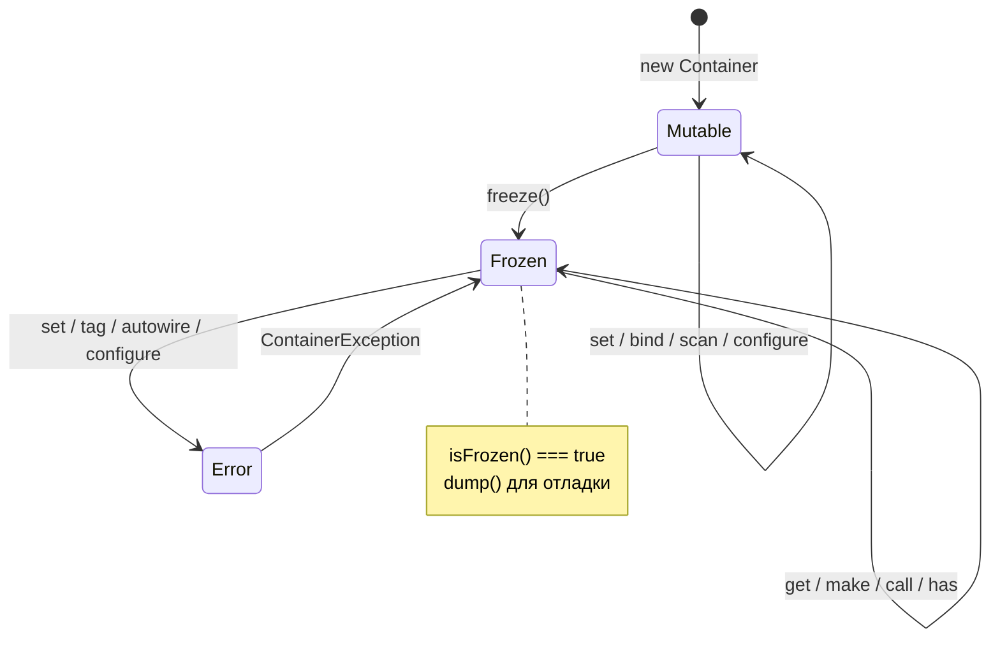

`dump()` и `getDefinitionIds()` доступны в обоих состояниях.

---

## `registerAttribute()` и пользовательские attributes

```mermaid
flowchart LR
    Dev[ServiceIdAttribute class] --> Reg[registerAttribute или register_attributes в конфиге]
    Reg --> Registry[AttributeServiceIdRegistry]
    Registry --> Reader[AttributeServiceIdReader]
    Reader --> MR[MemberResolver]
    MR --> Get["container.get(custom id)"]
```

Встроенные `Inject` / `Autowire` регистрируются в registry по умолчанию; пользовательские — только после `registerAttribute()`.

---

## Глобальный реестр `ContainerRegistry`

```mermaid
sequenceDiagram
    participant Bootstrap
    participant C as Container
    participant CR as ContainerRegistry
    participant App as Код приложения
    participant Test as Тест tearDown

    Bootstrap->>C: wiring + опционально freeze
    Bootstrap->>CR: set(container)
    App->>CR: get()
    CR-->>App: тот же ContainerInterface
    Test->>CR: reset()
    Note over CR: изоляция между тестами
```

---

## См. также

- [Конфигурация из файлов](Configuration)
- [Быстрый старт](Quick-start)
- [call(), bind(), afterResolving](Call-bind-callbacks)
- [Autowiring](Autowiring)
- [Сканирование классов](Class-scanning)
- [Прототипы, alias и lazy](Prototypes-alias-lazy)
- [Фабрики и singleton](Factories-and-singleton)
- [Теги и декораторы](Tags-and-decorators)
- [Справочник API](API-reference)
