# Архитектура и принцип работы

На этой странице — схемы жизненного цикла сервисов, autowiring, сканирования и вспомогательных механизмов пакета **cloudcastle/di**.

## Обзор компонентов

Публичная точка входа — `Container`. Внутренние классы не предназначены для прямого использования в приложении, но формируют чёткое разделение ответственности.

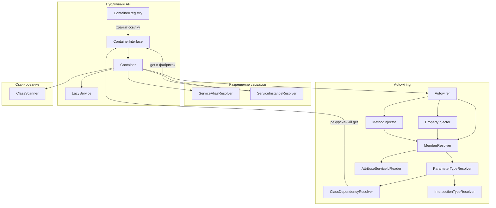

| Компонент | Роль |
|-----------|------|
| `Container` | Регистрация (`set`, `autowire`, `tag`, `decorate`, `alias`), флаги autowiring, делегирование resolve |
| `ServiceAliasResolver` | Цепочки `alias → targetId`, детекция циклов |
| `ServiceInstanceResolver` | Кэш, definitions, autowiring, декораторы; общий для `get()` и `make()` |
| `Autowirer` | `new` + property + method injection |
| `ClassScanner` | Парсинг PHP-файлов без выполнения, список FQCN |
| `LazyService` | Отложенный `get()` при первом `getValue()` |
| `ContainerRegistry` | Глобальный singleton-контейнер приложения |

---

## Жизненный цикл приложения (bootstrap)

Типичный composition root: один контейнер на запрос (PHP-FPM) или на worker.

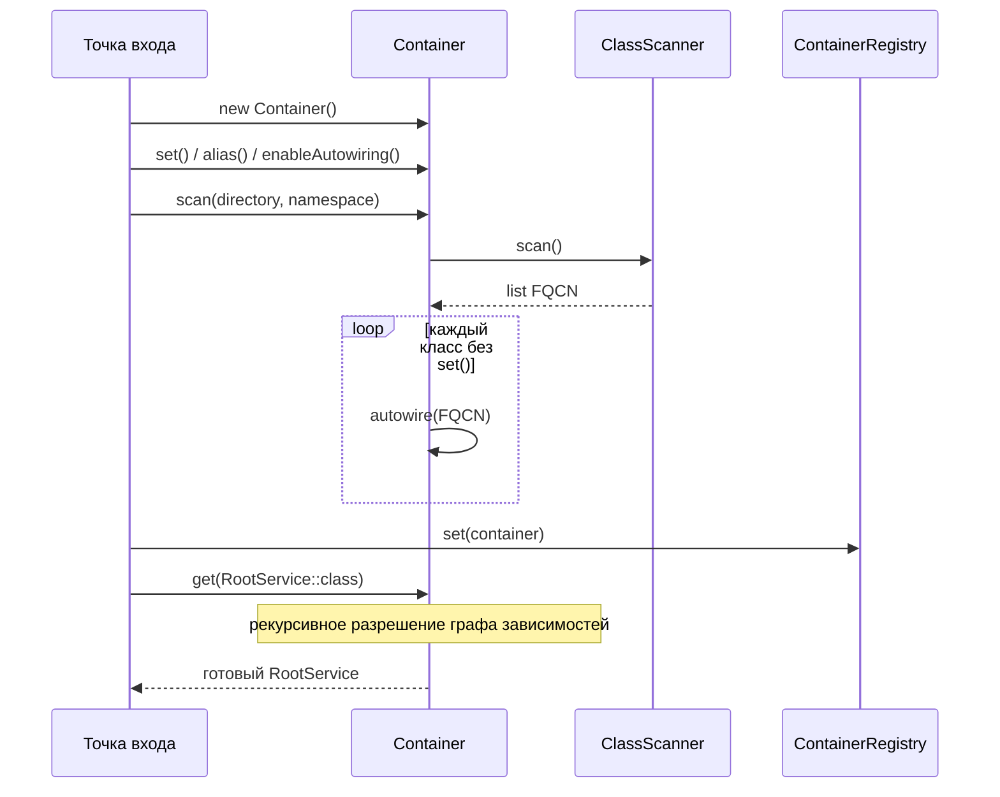

**Приоритет регистрации:** явный `set(id)` всегда сильнее autowiring для того же `id`. `scan()` не перезаписывает существующие `set()`.

---

## `get()` и `make()`: общий путь разрешения

Оба метода сначала разрешают alias, затем вызывают `ServiceInstanceResolver` с флагом singleton.

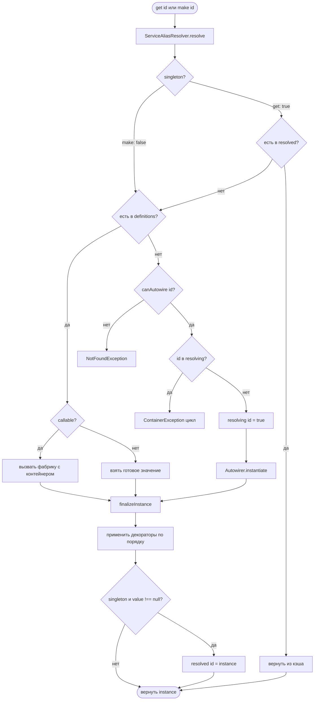

| | `get()` | `make()` |
|---|---------|----------|
| Читает `resolved` | да | нет |
| Пишет в `resolved` | да (если не `null`) | нет |
| Фабрика | один раз до `set`/`decorate` | каждый вызов |
| Autowiring | кэшируется | новый объект |
| Декораторы | да | да |

---

## Autowiring: создание объекта

`Autowirer::instantiate()` — единственная точка создания классов через reflection.

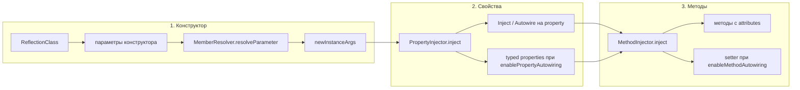

При autowiring зависимости конструктора снова вызывают `$container->get()` — поэтому возможны цепочки и циклы (отслеживаются в `resolving`).

---

## Разрешение одного параметра / свойства

`MemberResolver` задаёт **фиксированный порядок** для конструктора, свойств и методов.

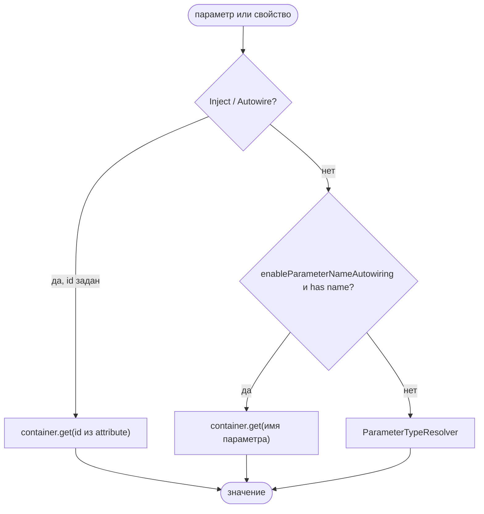

### Разрешение по типу (`ParameterTypeResolver`)

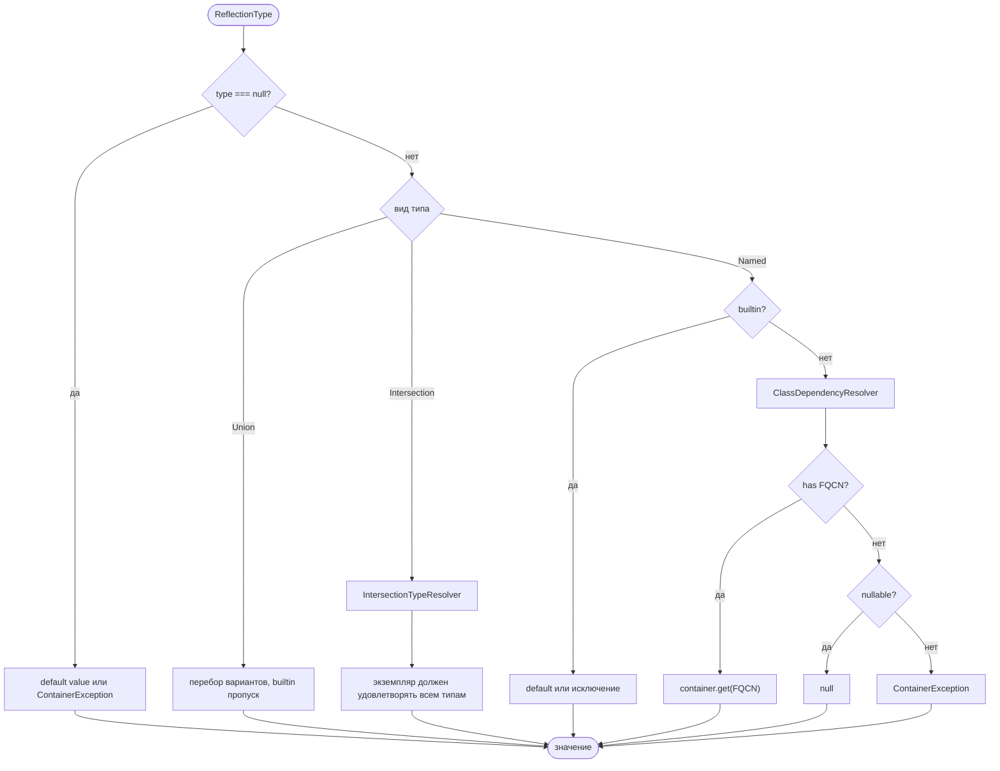

Особые случаи:

- `ContainerInterface` / `Psr\Container\ContainerInterface` → текущий контейнер
- Intersection `A&B` → сервис, проходящий проверку всех интерфейсов
- Union → первый подходящий не-builtin тип с `has()`

---

## Циклические зависимости

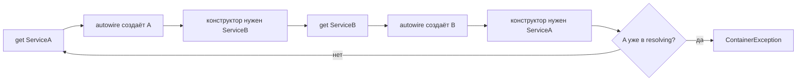

Стек `resolving` очищается в `finally` после успеха или ошибки instantiate.

**Важно:** циклы в **фабриках** `set()` не отслеживаются — возможен бесконечный рекурсивный `get()`.

---

## Alias

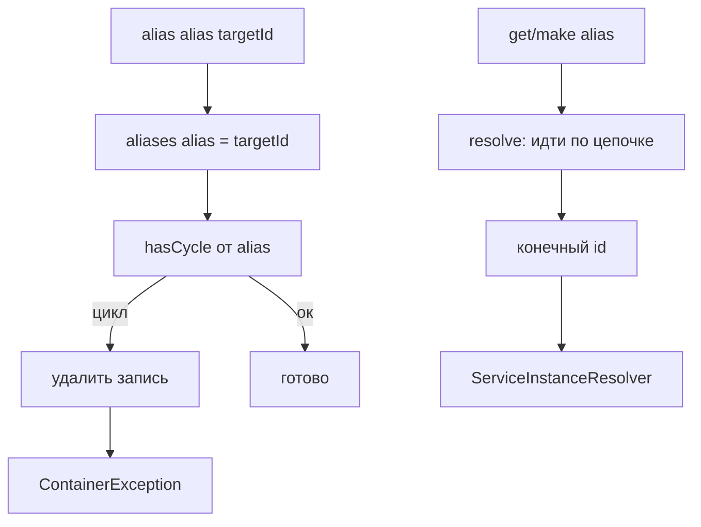

`has()` возвращает `true` для id, зарегистрированного как alias, даже если target ещё не создан.

---

## Lazy-сервис

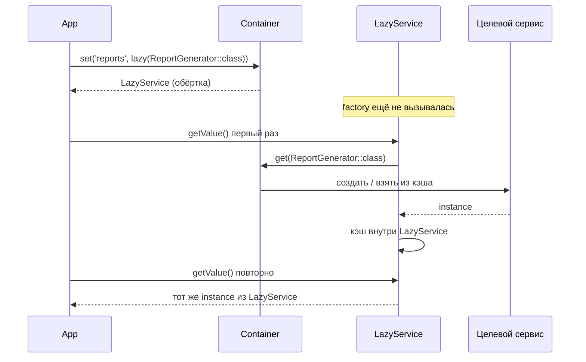

Singleton-кэш контейнера для целевого id заполняется при **первом** `get()` внутри `LazyService`, не при `set(lazy(...))`.

---

## Декораторы

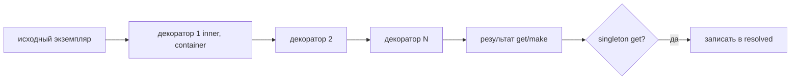

`decorate(id)` сбрасывает `resolved[id]`. Порядок: первый зарегистрированный декоратор ближе к inner.

---

## Tagged services

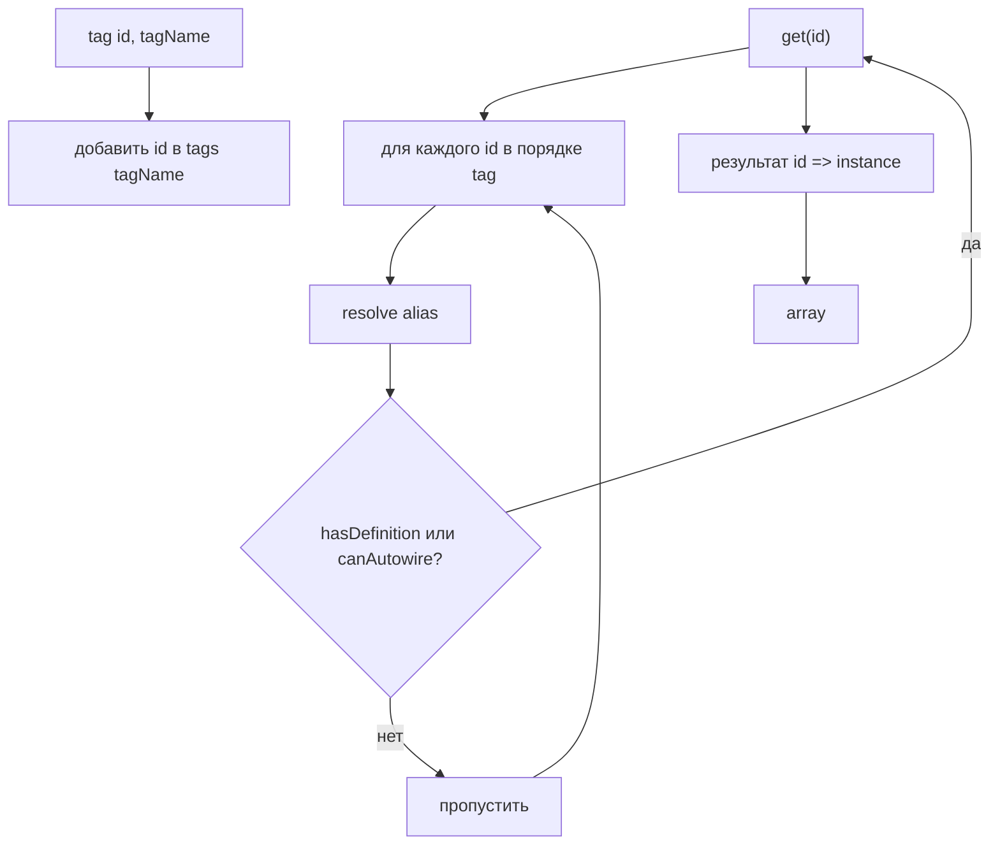

Ключ в результате — **исходный** id из `tag()`, значение — после полного `get()` (с alias и декораторами).

---

## Сканирование каталога (`scan`)

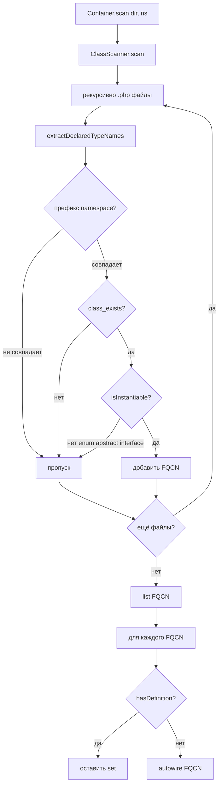

Парсинг **не выполняет** PHP-код файла; `class_exists()` загружает класс через Composer autoload.

---

## Хранилища состояния контейнера

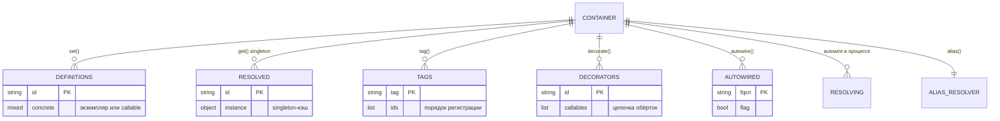

---

## Сравнение путей регистрации и получения

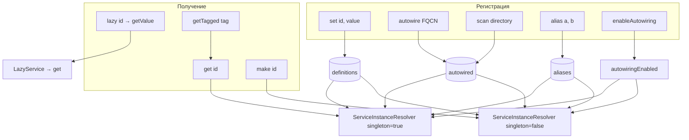

---

## См. также

- [Быстрый старт](Quick-start)
- [Autowiring](Autowiring)
- [Сканирование классов](Class-scanning)
- [Прототипы, alias и lazy](Prototypes-alias-lazy)
- [Фабрики и singleton](Factories-and-singleton)
- [Теги и декораторы](Tags-and-decorators)
- [Справочник API](API-reference)
