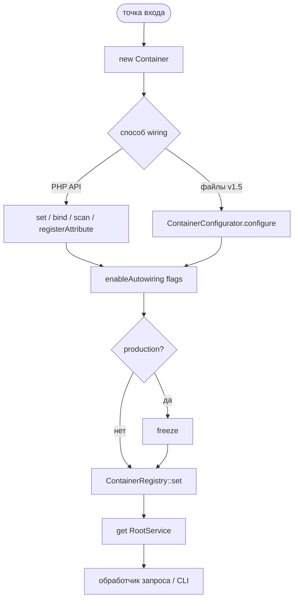

<p align="center">
  
</p>

# 🧪 Composition root: примеры bootstrap

> [← Главная](Home) · [Сравнение](Comparison) · [Quick start](Quick-start)


Ниже — пошаговые примеры сборки графа зависимостей (composition root) для разных сценариев использования CloudCastle DI.

## Схема composition root



---

Точка входа для простого PHP-приложения без фреймворка:

```php
<?php
// public/index.php

declare(strict_types=1);

use CloudCastle\DI\Container;
use Psr\Log\LoggerInterface;
use Psr\Log\NullLogger;

require_once __DIR__ . '/../vendor/autoload.php';

$container = new Container();

// --- Инфраструктура ---
$container->set('config', require __DIR__ . '/../config/app.php');
$container->set(
    'logger',
    static fn (Container $c): LoggerInterface => match ($c->get('config')['env']) {
        'production' => new FileLogger('/var/log/app.log'),
        default      => new NullLogger(),
    },
);
$container->set(
    'db',
    static fn (Container $c): PDO => new PDO(
        $c->get('config')['dsn'],
        $c->get('config')['db_user'],
        $c->get('config')['db_pass'],
    ),
);

// --- Репозитории ---
$container->set(
    'users.repository',
    static fn (Container $c): UserRepository => new UserRepository($c->get('db')),
);

// --- Сервисы приложения ---
$container->set(
    'users.service',
    static fn (Container $c): UserService => new UserService(
        $c->get('users.repository'),
        $c->get('logger'),
    ),
);

// --- Обработка запроса ---
$request = [
    'uri'    => $_SERVER['REQUEST_URI'],
    'method' => $_SERVER['REQUEST_METHOD'],
];

$router = new Router($container);
$router->dispatch($request);
```

## CLI-скрипт

Консольная команда с собственной точкой входа:

```php
<?php
// bin/process-orders.php

declare(strict_types=1);

use CloudCastle\DI\Container;

require_once __DIR__ . '/../vendor/autoload.php';

$container = new Container();

$container->set('config', require __DIR__ . '/../config/cli.php');
$container->set(
    'logger',
    static fn (): LoggerInterface => new ConsoleLogger(),
);
$container->set(
    'db',
    static fn (Container $c): PDO => new PDO(
        $c->get('config')['dsn'],
        $c->get('config')['db_user'],
        $c->get('config')['db_pass'],
    ),
);
$container->set(
    'orders.processor',
    static fn (Container $c): OrderProcessor => new OrderProcessor(
        $c->get('db'),
        $c->get('logger'),
    ),
);

$processor = $container->get('orders.processor');
$processor->processBatch();
```

### Вынос wiring в отдельную функцию

```php
<?php
// bootstrap.php

declare(strict_types=1);

use CloudCastle\DI\Container;
use CloudCastle\DI\Contract\ContainerInterface;

function createContainer(array $config): ContainerInterface
{
    $c = new Container();

    $c->set('config', $config);
    $c->set(
        'db',
        static fn (Container $c): PDO => new PDO(
            $c->get('config')['dsn'],
            $c->get('config')['db_user'],
            $c->get('config')['db_pass'],
        ),
    );
    $c->set(
        'logger',
        static fn (Container $c): LoggerInterface => match ($c->get('config')['env']) {
            'production' => new FileLogger('/var/log/app.log'),
            default      => new NullLogger(),
        },
    );

    return $c;
}
```

```php
// public/index.php — веб-точка входа
$container = createContainer(require __DIR__ . '/../config/app.php');
```

```php
// bin/process-orders.php — CLI точка входа
$container = createContainer(require __DIR__ . '/../config/cli.php');
```

### Модульная регистрация (v1.3)

```php
function registerInfrastructure(Container $c, array $config): void
{
    $c->addDefinitions([
        'config' => $config,
        'logger' => static fn (): LoggerInterface => new ConsoleLogger(),
    ]);

    $c->enableAutowiring();
    $c->bind(LoggerInterface::class, FileLogger::class);
    $c->bind(ClockInterface::class, SystemClock::class);

    $c->afterResolving(CacheInterface::class, static function ($id, $cache, $container): void {
        $cache->warm($container->get('config'));
    });
}
```

### Prod: конфигурация из файлов (v1.5)

```php
use CloudCastle\DI\Configuration\ContainerConfigurator;
use CloudCastle\DI\Container;

function createContainer(): Container
{
    $container = new Container();
    $configurator = new ContainerConfigurator();

    $configurator->configure($container, [
        __DIR__ . '/../config/services.php',
        __DIR__ . '/../config/' . (getenv('APP_ENV') ?: 'dev') . '.json',
    ]);

    $container->freeze();

    return $container;
}
```

См. [Конфигурация из файлов](Configuration).

### Prod: заморозка после bootstrap (v1.4)

```php
function createContainer(array $config): Container
{
    $container = new Container();
    registerInfrastructure($container, $config);
    registerApplication($container);
    $container->freeze();

    return $container;
}
```

Отладка wiring без `get()`:

```php
$ids = $container->getDefinitionIds();
$state = $container->dump(); // aliases, tags, resolved, флаги autowiring
```

### Обработчики по тегу

```php
$container->enableAutowiring();
$container->scan(__DIR__ . '/../src/Handler', 'App\\Handler\\');

// scan() регистрирует классы через autowire(); теги — явно:
$scanner = new \CloudCastle\DI\ClassScanner();
foreach ($scanner->scan(__DIR__ . '/../src/Handler', 'App\\Handler\\') as $handlerClass) {
    $container->tag($handlerClass, 'app.handlers');
}

foreach ($container->getTaggedIterator('app.handlers') as $handler) {
    $handler->register($container->get('event.bus'));
}
```

## Тесты

### Unit-тест с полным bootstrap

```php
<?php

declare(strict_types=1);

use CloudCastle\DI\Container;
use PHPUnit\Framework\TestCase;

final class OrderServiceTest extends TestCase
{
    private Container $container;

    protected function setUp(): void
    {
        $this->container = new Container();

        $this->container->set('clock', new FixedClock('2026-01-01T12:00:00+00:00'));
        $this->container->set(
            'order.repository',
            static fn (): OrderRepository => new InMemoryOrderRepository(),
        );
        $this->container->set(
            'order.service',
            static fn (Container $c): OrderService => new OrderService(
                $c->get('order.repository'),
                $c->get('clock'),
            ),
        );
    }

    public function testCreatesOrderWithCurrentTimestamp(): void
    {
        $service = $this->container->get('order.service');
        $order = $service->create();
        self::assertSame('2026-01-01T12:00:00+00:00', $order->createdAt);
    }
}
```

### Интеграционный тест с вынесенным bootstrap

```php
<?php

declare(strict_types=1);

use CloudCastle\DI\Container;
use CloudCastle\DI\Contract\ContainerInterface;
use PHPUnit\Framework\TestCase;

final class OrderPersistenceTest extends TestCase
{
    private ContainerInterface $container;

    protected function setUp(): void
    {
        $this->container = createTestContainer([
            'dsn'     => 'sqlite::memory:',
            'db_user' => '',
            'db_pass' => '',
        ]);

        $this->container->get('db')->exec('CREATE TABLE orders (id INTEGER, created_at TEXT)');
    }

    public function testPersistsAndRetrievesOrder(): void
    {
        $service = $this->container->get('order.service');
        $order = $service->create();

        $repo = $this->container->get('order.repository');
        $found = $repo->findById($order->id);

        self::assertNotNull($found);
    }
}

function createTestContainer(array $overrides = []): ContainerInterface
{
    $c = new Container();

    $c->set('config', array_merge([
        'dsn'     => 'sqlite::memory:',
        'db_user' => '',
        'db_pass' => '',
    ], $overrides));

    $c->set('db', static fn (Container $c): PDO => new PDO(
        $c->get('config')['dsn'],
        $c->get('config')['db_user'],
        $c->get('config')['db_pass'],
    ));

    $c->set(
        'order.repository',
        static fn (Container $c): OrderRepository => new SqlOrderRepository($c->get('db')),
    );

    $c->set(
        'order.service',
        static fn (Container $c): OrderService => new OrderService(
            $c->get('order.repository'),
            new FixedClock('2026-01-01T00:00:00+00:00'),
        ),
    );

    return $c;
}
```

## Production: compiled и opt-in (v1.9–1.18)

После wiring на dev/stage:

1. **`freeze()`** — запрет изменений графа ([Compiled container](Compiled-container)).
2. **`ContainerCompiler`** — генерация compiled-класса для prod (hot path без reflection).
3. **Opt-in** (только если нужно): `enableProfiling()` (v1.15), `enablePooling()` (v1.16), `cacheFor()` / `cacheTagFor()` (v1.17), `lazyGhost()` для interface (v1.18, suggest `symfony/var-exporter`).

Подробнее — [Performance and load](Performance-and-load), [Prototypes-alias-lazy](Prototypes-alias-lazy).

## Рекомендации

- **Одна точка сборки** — регистрируйте все сервисы в одном месте (composition root), не размазывайте set() по коду.
- **Возвращайте интерфейс** — createContainer() возвращает ContainerInterface, а не конкретный Container.
- **CLI vs HTTP** — для консольных команд собирайте облегчённый контейнер без middleware и HTTP-стека.
- **Тесты изолированы** — новый Container на каждый test; `ContainerRegistry::reset()` в `tearDown` при глобальном реестре.
- **Не передавайте контейнер в доменный слой** — см. [Анти-паттерны](Anti-patterns).
