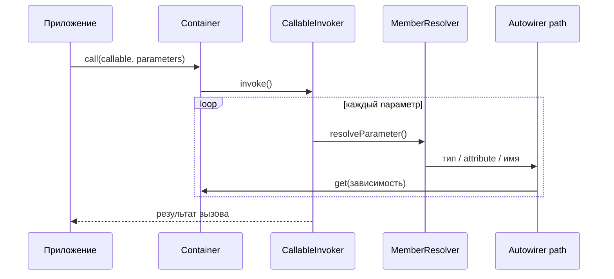
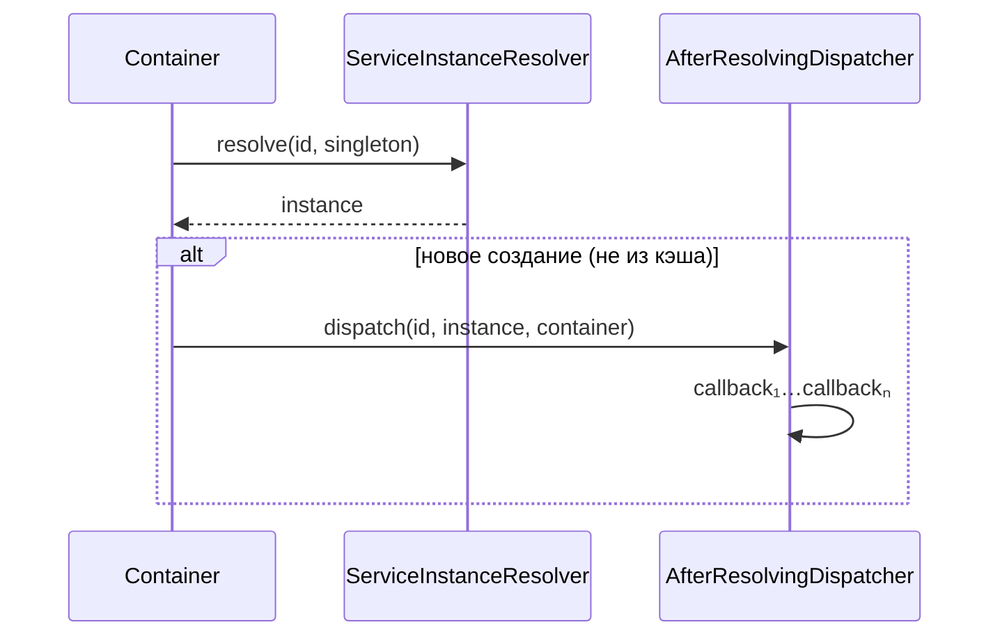

# call(), bind(), afterResolving и массовая регистрация

Расширения **v1.3.0**: вызов callable с autowiring, привязка абстракции к реализации, callback после resolve, массовый `set()` и расширенный API тегов.

> Схемы потоков — [Архитектура](Architecture#containercall-и-callableinvoker) · [afterResolving](Architecture#afterresolving-и-afterresolvingdispatcher).

## Обзор

| API | Класс / механизм | Назначение |
|-----|------------------|------------|
| `call()` | `CallableInvoker` | Вызов функции/метода с autowiring параметров |
| `bind()` | `ServiceAliasResolver` + `autowire()` | Интерфейс → класс или id одной строкой |
| `addDefinitions()` | цикл `set()` | Массовая регистрация из массива |
| `afterResolving()` | `AfterResolvingDispatcher` | Пост-обработка после **нового** resolve |
| `getTaggedIds()` / `getTaggedIterator()` / `getTaggedLocator()` | `TaggedServiceIterator`, `TaggedServiceLocator` | Работа с тегами без eager `getTagged()` |

---

## `call(callable $callable, array $parameters = []): mixed`

Вызывает функцию, closure, метод объекта или static-метод с **autowiring параметров** — те же правила, что у конструктора при `get()`:

1. PHP attributes `#[Inject]` / `#[Autowire]` на параметре;
2. autowiring по имени параметра, если включён (`$logger` → id `'logger'`);
3. разрешение по типу параметра → `get(FQCN)`.

Явные значения в `$parameters` (ключ — **имя параметра**) **переопределяют** autowire.

### Поддерживаемые формы callable

| Форма | Пример |
|-------|--------|
| Closure / arrow function | `static fn (LoggerInterface $l) => $l->info('ok')` |
| First-class callable | `$handler->handle(...)` |
| Массив метод | `[self::class, 'factory']` |
| Invokable-объект | `$command` с `__invoke()` |
| Имя функции | `'strlen'` + `['string' => 'abc']` |

### Примеры

```php
$container->enableAutowiring();

$result = $container->call(
    static fn (LoggerInterface $logger, string $message) => $logger->info($message),
    ['message' => 'started'],
);

$handler = new OrderHandler();
$container->call($handler->handle(...), ['orderId' => 42]);
```

### Реализация

`Container::call()` делегирует ленивому `CallableInvoker`, который:

1. строит `ReflectionFunction` / `ReflectionMethod` для callable;
2. для каждого параметра вызывает `MemberResolver::resolveParameter()` (тот же путь, что у `Autowirer`);
3. выполняет callable через `invokeArgs`.

В приложении достаточно `Container::call()` — `CallableInvoker` не предназначен для прямого использования.



---

## `bind(string $abstract, string $concrete): void`

Сокращение для типичной привязки интерфейса / абстракции к реализации:

| `$concrete` | Поведение |
|------------|-----------|
| instantiable **класс** | `autowire($concrete)` + `alias($abstract, $concrete)` |
| существующий **id** (`set`, `autowire`, alias) | только `alias($abstract, $concrete)` |
| иначе | `ContainerException` |

```php
$container->enableAutowiring();
$container->bind(LoggerInterface::class, FileLogger::class);

$logger = $container->get(LoggerInterface::class); // FileLogger

$container->set('app.mailer', $mailer);
$container->bind(MailerInterface::class, 'app.mailer');
```

### `bind()` vs `alias()`

| | `bind()` | `alias()` |
|---|----------|-----------|
| Регистрирует класс | да (`autowire` для FQCN) | нет |
| Только переименование id | нет | да |
| Типичный сценарий | интерфейс → реализация | строковый id → FQCN |

---

## `addDefinitions(array $definitions): void`

Массовый `set()` — эквивалент последовательных вызовов `set($id, $concrete)`:

```php
$container->addDefinitions([
    'config' => $configArray,
    'logger' => static fn (Container $c) => new FileLogger($c->get('config')),
    'db' => static fn (Container $c) => new PDO($c->get('config')['dsn']),
]);
```

Порядок, приоритет над autowiring и сброс singleton-кэша — как у `set()`.

Удобно для конфигурационных массивов из файла bootstrap или модуля плагина.

---

## `afterResolving(string $id, callable $callback): void`

Регистрирует callback:

```php
callable(string $id, mixed $instance, ContainerInterface $container): void
```

### Когда вызывается

| Сценарий | Callback |
|----------|----------|
| Первый `get($id)` — экземпляр создан | да |
| Повторный `get($id)` из singleton-кэша | **нет** |
| Каждый `make($id)` — новый экземпляр | **да** (на каждый вызов) |

Несколько callback для одного id выполняются в порядке регистрации.

### Пример

```php
$container->afterResolving(UserRepository::class, static function (
    string $id,
    object $repo,
    ContainerInterface $c,
): void {
    assert($repo instanceof UserRepository);
    $c->get('audit')->record('resolved', $id);
});
```

### Реализация

`Container::resolveService()` после `ServiceInstanceResolver::resolve()` вызывает `AfterResolvingDispatcher::dispatch()`, если экземпляр **не** был взять из singleton-кэша до resolve (`$wasCached === false`).



Типичные сценарии: аудит, warmup кэша, регистрация в реестре, логирование времени создания.

---

## Расширенный API тегов (v1.3)

См. подробно — [Теги и декораторы](Tags-and-decorators#сравнение-api-тегов).

| Метод | Возвращает | Создаёт экземпляры |
|-------|------------|-------------------|
| `getTagged($tag)` | `id => instance` | да (eager) |
| `getTaggedIds($tag)` | `list<id>` | нет |
| `getTaggedIterator($tag)` | только значения | да при итерации |
| `getTaggedLocator($tag)` | `has` / `get` / iterate | при `get()` / итерации |

---

## См. также

- [Теги и декораторы](Tags-and-decorators)
- [Прототипы, alias и lazy](Prototypes-alias-lazy) — `bind()` как альтернатива ручному `alias()`
- [Справочник API](API-reference)
- [Autowiring](Autowiring)
- [Примеры bootstrap](Bootstrap)
