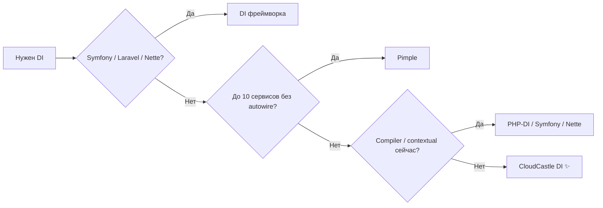

  

# 📊 Сравнение с аналогами

> **CloudCastle DI** — лёгкий **PSR-11** контейнер для **PHP 8.1+**. Одна runtime-зависимость — `psr/container`.

Сравниваем **пять аналогов**: [PHP-DI](https://php-di.org/), [Symfony DI](https://symfony.com/doc/current/service_container.html), [Pimple](https://pimple.symfony.com/), [Laravel Container](https://laravel.com/docs/container), [Nette DI](https://doc.nette.org/en/configuring).

**Формат таблицы:** функция → поддержка в каждой библиотеке → **🏆 победитель**.

---

## Как читать таблицу

| Символ | Значение |
|:------:|----------|
| ✅ | Полная поддержка «из коробки» |
| ⚠️ | Частично, с ограничениями или опционально |
| ❌ | Нет или не предусмотрено |
| 🔌 | Только через адаптер / расширение |

**Победитель** — библиотека (или несколько через запятую), которая лучше закрывает критерий для типичного standalone-проекта. При равной функциональности — **Паритет**.

---

## 🧭 Быстрый выбор за 30 секунд

| Сценарий | Рекомендация |
|----------|--------------|
| Composition root в библиотеке, CLI, API | **CloudCastle DI** |
| Уже Symfony / Laravel / Nette | **Встроенный DI** |
| 3–5 сервисов, без autowiring | **Pimple** |
| Compiled + NEON, экосистема Nette | **Nette DI** |
| Огромный граф + compiler вне Nette | **PHP-DI** или **Symfony DI** |

---

## 📋 Сводная таблица возможностей

### Основа и экосистема

| Функция | CloudCastle DI | PHP-DI | Symfony DI | Pimple | Laravel | Nette DI | 🏆 Победитель |
|---------|:--------------:|:------:|:----------:|:------:|:-------:|:--------:|---------------|
| **PSR-11** | ✅ | ✅ | ✅ | 🔌 | ✅ | 🔌 | **CloudCastle**, PHP-DI, Symfony, Laravel |
| **Мин. PHP** | ^8.1 | 8.1+ | 8.2+ | 7.2+ | 8.2+ | 8.1+ | **Pimple** (legacy) |
| **Runtime deps (Composer)** | 1 | неск. | symfony/* | 0 | illuminate/* | nette/* | **Pimple** → **CloudCastle** |
| **Standalone без фреймворка** | ✅ | ✅ | ⚠️ | ✅ | ⚠️ | ✅ | **CloudCastle**, PHP-DI, Pimple, **Nette** |
| **Зрелость / community** | ⚠️ | ✅ | ✅✅ | ✅ | ✅✅ | ✅ | **Symfony**, **Laravel** |
| **Открытый CI + benchmark-check** | ✅ | ⚠️ | ⚠️ | ❌ | ⚠️ | ⚠️ | **CloudCastle DI** |

### Регистрация и жизненный цикл

| Функция | CloudCastle DI | PHP-DI | Symfony DI | Pimple | Laravel | Nette DI | 🏆 Победитель |
|---------|:--------------:|:------:|:----------:|:------:|:-------:|:--------:|---------------|
| **Явная регистрация** | ✅ `set()` | ✅ | ✅ config | ✅ | ✅ | ✅ config | **Паритет** |
| **Фабрики (callable)** | ✅ | ✅ | ✅ | ✅ | ✅ | ✅ | **Паритет** |
| **Singleton-кэш** | ✅ | ✅ | ✅ shared | ✅ | ✅ | ✅ | **Паритет** |
| **Прототипы (`make`)** | ✅ | ✅ | ✅ | ⚠️ | ✅ | ✅ | **CloudCastle**, PHP-DI, Symfony, Laravel, **Nette** |
| **Alias** | ✅ | ✅ | ✅ | ⚠️ | ✅ | ✅ | **Паритет** |
| **`hasDefinition()` без создания** | ✅ | ⚠️ | ✅ | ❌ | ⚠️ | ✅ | **CloudCastle**, **Symfony**, **Nette** |
| **`freeze()` после bootstrap** | ✅ | ⚠️ | ✅ compile | ❌ | ❌ | ✅ compile | **CloudCastle**, **Symfony**, **Nette** |
| **`dump()` / интроспекция** | ✅ | ⚠️ | ✅ | ❌ | ⚠️ | ✅ | **Symfony**, **Nette**, **CloudCastle** |

### Autowiring и reflection

| Функция | CloudCastle DI | PHP-DI | Symfony DI | Pimple | Laravel | Nette DI | 🏆 Победитель |
|---------|:--------------:|:------:|:----------:|:------:|:-------:|:--------:|---------------|
| **Constructor autowiring** | ✅ | ✅ | ✅ | ❌ | ✅ | ✅ | **Паритет** (кроме Pimple) |
| **Property injection** | ✅ | ✅ | ✅ | ❌ | ✅ | ✅ | **Паритет** (кроме Pimple) |
| **Method / setter injection** | ✅ | ✅ | ✅ | ❌ | ✅ | ✅ | **Паритет** (кроме Pimple) |
| **PHP Attributes** | ✅ | ✅ | ✅ | ❌ | ✅ | ✅ | **Паритет** (кроме Pimple) |
| **Свои attributes** | ✅ | ⚠️ | ✅ | ❌ | ✅ | ✅ | **CloudCastle**, Symfony, Laravel, **Nette** |
| **Autowiring по имени параметра** | ✅ | ✅ | ✅ | ❌ | ✅ | ✅ | **Паритет** (кроме Pimple) |
| **Union / nullable** | ✅ | ✅ | ✅ | ❌ | ✅ | ✅ | **Паритет** (кроме Pimple) |
| **Intersection types** | ✅ | ✅ | ✅ | ❌ | ✅ | ✅ | **Паритет** (кроме Pimple) |
| **Детекция циклов** | ✅ | ✅ | ✅ | — | ✅ | ✅ | **Паритет** |
| **Autoconfigure / `_instanceof`** | ❌ | ⚠️ | ✅ | ❌ | ✅ | ✅ extensions | **Symfony**, Laravel, **Nette** |

### Сканирование и конфигурация

| Функция | CloudCastle DI | PHP-DI | Symfony DI | Pimple | Laravel | Nette DI | 🏆 Победитель |
|---------|:--------------:|:------:|:----------:|:------:|:-------:|:--------:|---------------|
| **Сканирование каталога** | ✅ regex | ✅ | ✅ Resource | ❌ | ⚠️ | ✅ RobotLoader | **Symfony**, **Nette** |
| **Декларативный конфиг PHP** | ✅ | ✅ | ✅ | ❌ | ✅ | ✅ | **Паритет** |
| **JSON / YAML / XML** | ✅ | ✅ | ✅ | ❌ | ✅ | ✅ NEON | **Symfony**, **Nette**, **CloudCastle** |
| **Каталог конфигов (v1.7)** | ✅ | ⚠️ | ✅ | ❌ | ✅ | ✅ | **CloudCastle**, Symfony, **Nette** |
| **Приоритеты слоёв** | ✅ | ⚠️ | ✅ | ❌ | ✅ | ✅ | **Symfony**, **CloudCastle**, **Nette** |
| **Compiled container (prod)** | ✅ v1.9 | ✅ | ✅ | ❌ | ✅ | ✅ | **PHP-DI**, **Symfony**, Laravel, **Nette** |

### Расширенный API

| Функция | CloudCastle DI | PHP-DI | Symfony DI | Pimple | Laravel | Nette DI | 🏆 Победитель |
|---------|:--------------:|:------:|:----------:|:------:|:-------:|:--------:|---------------|
| **`bind()` интерфейс → класс** | ✅ | ✅ | ✅ | ❌ | ✅ | ✅ | **Паритет** (кроме Pimple) |
| **`call()` с autowire** | ✅ | ✅ | ✅ | ❌ | ✅ | ✅ | **Паритет** (кроме Pimple) |
| **After-resolve hooks** | ✅ | ✅ | ✅ | ❌ | ⚠️ | ✅ setup | **CloudCastle**, PHP-DI, Symfony, **Nette** |
| **Bulk definitions** | ✅ | ✅ | ✅ | ❌ | ✅ | ✅ | **Паритет** |
| **Tagged services** | ✅ | ✅ | ✅ | ❌ | ✅ | ✅ | **Паритет** |
| **Tagged iterator / locator** | ✅ | ✅ | ✅ | ❌ | ⚠️ | ✅ | **CloudCastle**, PHP-DI, Symfony, **Nette** |
| **Декораторы** | ✅ | ✅ | ✅ | ❌ | ✅ | ✅ | **Паритет** |
| **Lazy loading** | ✅ | ✅ proxy | ✅ ghost | ❌ | ✅ | ✅ | **Symfony** (ghost proxies) |
| **Contextual binding** | ⚠️ v1.11 runtime | ✅ | ✅ | ❌ | ✅ | ✅ | **PHP-DI**, Symfony, Laravel, **Nette** |
| **Scopes (request и т.д.)** | ❌ v2 | ⚠️ | ✅ | ❌ | ✅ | ⚠️ | **Symfony**, **Laravel** |

### Интеграция и прочее

| Функция | CloudCastle DI | PHP-DI | Symfony DI | Pimple | Laravel | Nette DI | 🏆 Победитель |
|---------|:--------------:|:------:|:----------:|:------:|:-------:|:--------:|---------------|
| **Глобальный реестр** | ✅ | ❌ | ❌ | ❌ | ✅ Facades | ❌ | **Laravel**, **CloudCastle** |
| **Service providers / extensions** | ❌ | ⚠️ | ✅ bundles | ❌ | ✅ | ✅ | **Symfony**, Laravel, **Nette** |
| **Интеграция с kernel** | ❌ | ❌ | ✅ | ❌ | ✅ | ✅ | **Symfony**, Laravel, **Nette** |
| **Простота API** | ⚠️ | ⚠️ | ❌ | ✅✅ | ⚠️ | ⚠️ | **Pimple** |
| **Компактность / аудит кода** | ✅ | ⚠️ | ❌ | ✅✅ | ❌ | ⚠️ | **Pimple**, **CloudCastle** |

---

## ✨ Когда выбирать CloudCastle DI

  

| ✅ Подходит | ❌ Лучше другой вариант |
|-------------|-------------------------|
| Composition root в **библиотеке**, CLI, API | Уже **Symfony** / **Laravel** / **Nette** |
| Autowiring + теги **без** фреймворка | **Compiled** (v1.9) + конфиг; contextual — v2 |
| Граф **~10–500** сервисов | **Legacy PHP &lt; 8.1** |
| **Одна** зависимость `psr/container` | 3–5 `set()` без autowire → **Pimple** |
| Декларативный конфиг опционален | Огромный enterprise-граф + bundles → **Symfony** |

---

## 🔄 Миграция (кратко)

| Из | Действия |
|----|----------|
| **Pimple** | `$p['id'] = fn` → `set()`; `enableAutowiring()` для FQCN |
| **PHP-DI** | definitions → `set()` / `bind()` / `ContainerConfigurator`; compiler — `ContainerCompiler` (v1.9) |
| **Symfony** | `services.yaml` → `ContainerConfigurator` или PHP bootstrap |
| **Laravel** | providers → composition root; contextual → `bind()` (без per-class контекста в v1.x) |
| **Nette** | NEON → PHP/YAML/XML через `ContainerConfigurator`; extensions → `tag()` / bootstrap |

Подробнее — [Быстрый старт](Quick-start), [Конфигурация](Configuration), [Обновление версий](Upgrading).

---

## ⚖️ Итог: CloudCastle DI

### Преимущества

| | |
|---|---|
| 🪶 | Одна runtime-зависимость — `psr/container` |
| 🔧 | Autowiring: constructor, property, method, attributes |
| 📁 | `scan()`, конфиг PHP/JSON/YAML/XML, каталоги (v1.7) |
| 🏷️ | Теги, iterator, locator, декораторы, `call()`, `bind()` |
| 🧊 | `freeze()`, `dump()`, `ContainerRegistry` |
| 🧪 | 607 тестов, 100% line coverage `src/`, benchmark-check в CI |
| 📋 | Contextual binding — runtime v1.11 ([#25](https://github.com/cloudcastle-apps/di/issues/25) ч.2 ✅) |

### Ограничения (v1.x)

| | |
|---|---|
| 🚀 | **Compiled container** — `ContainerCompiler`, build-step ([#24](https://github.com/cloudcastle-apps/di/issues/24)) |
| 🚧 | Contextual **config/compiled** — [#25](https://github.com/cloudcastle-apps/di/issues/25) часть 3–4 |
| 📌 | `scan()` — regex-парсинг, не AST |
| 👥 | Меньше community, чем PHP-DI / Symfony / **Nette** |

---

## 📈 Производительность

Для **десятков–сотен** `get()` CloudCastle DI сопоставим с reflection-контейнерами. На **очень больших** графах compiled **Symfony** / **PHP-DI** / **Nette** быстрее.

Цифры — [Нагрузка и производительность](Performance-and-load).

---

## 🔗 См. также

- [FAQ](FAQ)
- [Архитектура](Architecture)
- [Анти-паттерны](Anti-patterns)
- [Roadmap v2](https://github.com/cloudcastle-apps/di/issues/17) · [Compiled container](Compiled-container)
