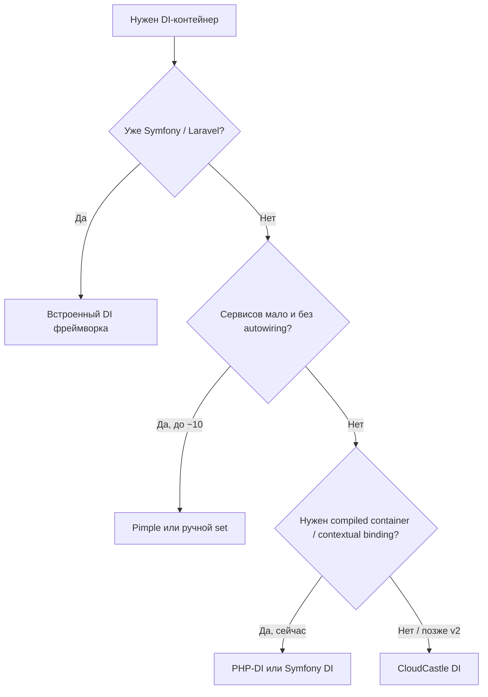

# Сравнение с PHP-DI, Symfony DI, Pimple и другими

**CloudCastle DI** — lightweight **PSR-11** dependency injection container for **PHP 8.3+**. Ниже — честное сравнение с популярными аналогами: когда выбирать CloudCastle DI, а когда лучше PHP-DI, Symfony DI или Pimple.

## В двух словах

| | CloudCastle DI | PHP-DI | Symfony DI | Pimple |
|---|:---:|:---:|:---:|:---:|
| **Позиционирование** | компактная библиотека | зрелый DI с compiled mode | DI фреймворка | микро-контейнер |
| **Runtime-зависимости** | `psr/container` | несколько пакетов | компоненты Symfony | нет (PSR частично) |
| **Autowiring** | ✓ | ✓ | ✓ | — |
| **YAML / compiled container** | — | ✓ | ✓ | — |
| **Contextual binding** | v2 (backlog) | ✓ | ✓ | — |
| **PHP 8.3+** | обязательно | 8.1+ | 8.2+ | 7.2+ |

**Итог:** CloudCastle DI закрывает **средний** сегмент — больше возможностей, чем Pimple, заметно меньше инфраструктуры, чем Symfony или PHP-DI с compiler. Подходит для **composition root** в библиотеках, CLI, API bootstrap и тестов.

---

## Преимущества CloudCastle DI

### Архитектура и зависимости

- **Одна runtime-зависимость** — `psr/container`; легко встроить в любой проект без «тяги» фреймворка.
- **Явный API** — `set()` / `get()` / `make()`; граф зависимостей читается в PHP-коде bootstrap без YAML.
- **PSR-11** из коробки; расширенный контракт `ContainerInterface` без нарушения совместимости.

### Возможности при компактном размере

- **Autowiring:** конструктор, typed properties, inject-методы; union, intersection, nullable; attributes `Inject` / `Autowire`; опционально by-name.
- **Composition root:** `scan()`, `tag()` / iterator / locator, `decorate()`, `bind()`, `call()`, `afterResolving()`, `lazy()`, `alias()`, прототипы `make()`.
- **Обнаружение циклов** при autowiring (не в произвольных фабриках `set()`).
- **Глобальный реестр** `ContainerRegistry` — опционален, удобен в legacy/bootstrap.

### Эксплуатация

- **MIT**, открытый CI (PHPStan, Psalm, Infection, load/performance-тесты).
- **Документация и Wiki** с архитектурными схемами и примерами bootstrap.
- **Предсказуемое поведение** — без скрытой магии kernel/autoconfigure Symfony.

### Когда это сильная сторона

- Микросервис, CLI, cron, worker с небольшим графом сервисов.
- Библиотека, которой нужен DI **внутри** пакета, но не весь Symfony.
- Unit/integration-тесты: быстрый `Container` + `set()` моков.
- Проект, где важны **аудит кода** и минимальный attack surface.

---

## Недостатки и ограничения CloudCastle DI

Честный список — чтобы не выбирать контейнер «навсегда» там, где нужен другой инструмент.

### Нет «тяжёлых» enterprise-фич (сейчас)

| Возможность | Статус | Где есть |
|-------------|--------|----------|
| **Compiled container** | backlog v2 (#24) | PHP-DI, Symfony |
| **Contextual binding** (`when` / `needs` / `give`) | backlog v2 (#25) | PHP-DI, Symfony |
| **Lazy ghost proxy** (без обёртки) | backlog (#34) | Symfony, PHP-DI |
| **Scopes** (request / transient) | v2 (#33) | Symfony, Laravel |
| **YAML / XML конфигурация** | не в scope | Symfony, PHP-DI |
| **Autoconfigure** (интерфейсы, теги по convention) | нет | Symfony |

### Технические ограничения

- **PHP ^8.3** — проекты на 8.1/8.2 не поддерживаются (PHP-DI и Pimple шире по версиям).
- **`scan()`** — парсинг regex, без полного AST; edge-cases с нестандартным синтаксисом файлов.
- **Циклы в фабриках** `set()` — не детектируются автоматически.
- **Потокобезопасность** — контейнер не синхронизирован (как у большинства PHP DI).
- **Меньше экосистемы**, чем у Symfony / Laravel — меньше готовых рецептов и статей.

### Когда лучше другой контейнер

- Уже **Symfony** или **Laravel** — используйте встроенный DI; дублировать CloudCastle DI смысла мало.
- Нужен **compiled container** на тысячи сервисов с жёсткими SLA cold start — PHP-DI / Symfony Compiler.
- Нужен **contextual binding** в production **сейчас** — PHP-DI или Symfony.
- Минимальный скрипт на **PHP 7.x / 8.0** — Pimple или старый PHP-DI.
- Только **ручная** регистрация 5–10 сервисов без autowiring — Pimple проще.

---

## CloudCastle DI vs PHP-DI

[PHP-DI](https://php-di.org/) — ближайший функциональный аналог.

### Где CloudCastle DI выигрывает

| Критерий | CloudCastle DI | PHP-DI |
|----------|----------------|--------|
| Зависимости composer | `psr/container` | `php-di/php-di` + транзитивные |
| Кривая обучения | один класс `Container` + Wiki | definitions, helpers, compiler |
| Bootstrap в библиотеке | лёгкий `new Container()` | настройка `ContainerBuilder` |
| Прозрачность кода | весь контейнер в одном пакете | больше слоёв абстракции |

### Где PHP-DI выигрывает

| Критерий | PHP-DI | CloudCastle DI |
|----------|--------|----------------|
| **Compiled container** | ✓, production-ready | план v2 |
| **Contextual injection** | ✓ `DI\addDefinitions` + attributes | backlog v2 |
| **Зрелость / community** | годы в production | молодой проект |
| **Документация на англ.** | обширный сайт | Wiki + README |
| **Минимальная версия PHP** | 8.1+ | 8.3+ |

**Миграция:** `set()` ≈ `set()`, `get()` ≈ `get()`, autowire по FQCN — аналогично. Нет прямого аналога compiled definitions и `DI\env()` — переносите в PHP bootstrap.

---

## CloudCastle DI vs Symfony DependencyInjection

[Symfony DI](https://symfony.com/doc/current/service_container.html) — эталон для крупных приложений.

### Где CloudCastle DI выигрывает

- Не тянет **symfony/*` компоненты** и Config / Yaml.
- Нет обязательного **CompilerPass** и cache warmup для простых сценариев.
- Быстрее **старт** для десятков–сотен сервисов без компиляции.
- Удобен **вне** Symfony (Slim, custom front controller, тесты).

### Где Symfony DI выигрывает

- **Autoconfigure**, autowiring aliases, `_instanceof`, `_defaults`.
- **Полноценные scopes**, lazy ghost proxies, decoration chains в config.
- **Интеграция** с EventDispatcher, Messenger, Security, Twig.
- **Экосистема** bundle'ов и best practices для monolith.

**Вывод:** Symfony DI — для Symfony-приложений и сложных графов. CloudCastle DI — когда Symfony DI **избыточен**, но Pimple **мал**.

---

## CloudCastle DI vs Pimple

[Pimple](https://pimple.symfony.com/) — микро-контейнер (устаревающий, но всё ещё в legacy).

### Где CloudCastle DI выигрывает

- **PSR-11** полностью (Pimple — `Psr\Container\ContainerInterface` через адаптер).
- **Autowiring**, attributes, `scan()`, теги, декораторы, `call()`, `bind()`.
- **Типобезопасность** и reflection вместо только closure-фабрик.

### Где Pimple выигрывает

- **Минимум кода** — один файл, нулевые зависимости.
- **Простейшая модель** — массив замыканий; идеален для 3–5 сервисов.
- **Широкая поддержка старых PHP**.

**Вывод:** Pimple — для legacy и тривиальных графов. CloudCastle DI — эволюция «явного wiring» с autowiring без Symfony.

---

## CloudCastle DI vs Laravel Container

[Laravel](https://laravel.com/docs/container) Container — мощный, но **часть фреймворка**.

| | CloudCastle DI | Laravel Container |
|---|:---:|:---:|
| Standalone library | ✓ | через `illuminate/container` |
| PSR-11 | ✓ | ✓ (с v8+) |
| Без фасадов / kernel | ✓ | сложнее |
| Contextual binding | v2 | ✓ |
| Service providers | нет | ✓ |

**Вывод:** в Laravel используйте встроенный контейнер. CloudCastle DI — для **non-Laravel** PHP.

---

## Сводная таблица возможностей

| Возможность | CloudCastle DI | PHP-DI | Symfony DI | Pimple |
|-------------|:---:|:---:|:---:|:---:|
| PSR-11 | ✓ | ✓ | ✓ | адаптер |
| `set()` / фабрики | ✓ | ✓ | ✓ | ✓ |
| Autowiring reflection | ✓ | ✓ | ✓ | — |
| PHP attributes | ✓ | ✓ | ✓ | — |
| Property / method inject | ✓ | ✓ | ✓ | — |
| Intersection types | ✓ | ✓ | ✓ | — |
| `scan()` каталогов | ✓ | ✓ | ✓ | — |
| Tagged services | ✓ | ✓ | ✓ | — |
| Iterator / locator по тегу | ✓ | ✓ | ✓ | — |
| Decorators | ✓ | ✓ | ✓ | — |
| `make()` / prototype | ✓ | ✓ | ✓ | вручную |
| `lazy()` | ✓ (обёртка) | ✓ | ghost proxy | — |
| `call()` autowire | ✓ | ✓ | ✓ | — |
| `bind()` / alias | ✓ | ✓ | ✓ | — |
| `afterResolving()` | ✓ | ✓ | ✓ | — |
| Compiled container | — | ✓ | ✓ | — |
| Contextual binding | — | ✓ | ✓ | — |
| YAML / XML config | — | ✓ | ✓ | — |
| Минимум зависимостей | ✓✓ | ✓ | — | ✓✓✓ |

---

## Матрица выбора

---

## Производительность

Для типичного bootstrap (десятки–сотни `get()` / autowire) CloudCastle DI сопоставим с reflection-based контейнерами без compilation. Подробные цифры и пороги — [Нагрузка и производительность](Performance-and-load).

**Важно:** compiled container Symfony / PHP-DI быстрее на **очень больших** графах и холодном старте. Для micro-library и средних приложений разница часто несущественна.

---

## Миграция

| Из | Действия |
|----|----------|
| **Pimple** | Заменить `$p['id']` на `$container->set()` / `get()`; включить autowiring для FQCN. |
| **PHP-DI** | Перенести definitions в `set()` / `bind()` / `scan()`; убрать compiler config; проверить contextual rules. |
| **Symfony** | Вынести только нужные `services.yaml` правила в PHP bootstrap; теги → `tag()` / `getTaggedIterator()`. |

См. [Обновление версий](Upgrading) и [Быстрый старт](Quick-start).

---

## См. также

- [FAQ](FAQ) — краткие ответы
- [Анти-паттерны](Anti-patterns) — service locator, глобальный контейнер
- [Архитектура](Architecture) — как устроен контейнер
- [Roadmap](https://github.com/cloudcastle-apps/di/issues/26) — v2: compiled container, contextual binding, scopes
