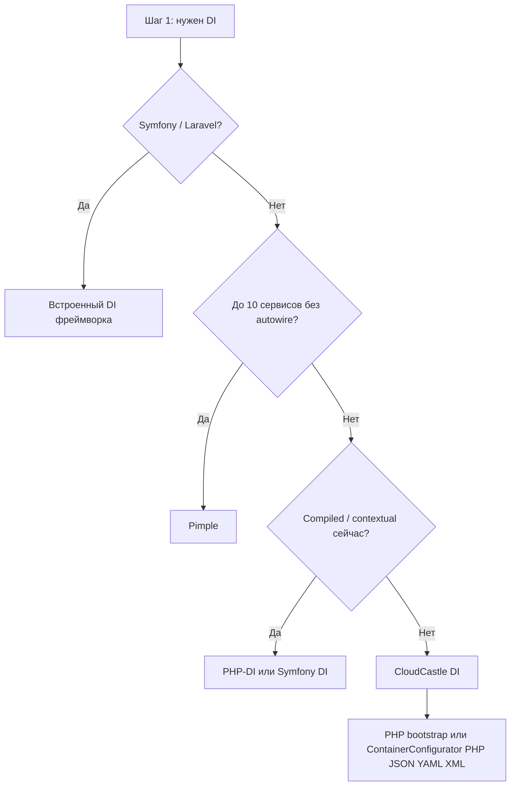

# Пошаговое сравнение с PHP-DI, Symfony DI, Pimple и другими

**CloudCastle DI** — lightweight **PSR-11** dependency injection container for **PHP 8.3+**.

На этой странице — **подробное** сравнение по шагам: для каждого критерия указаны плюсы и минусы CloudCastle DI относительно аналога. Краткая выжимка — в [README](https://github.com/cloudcastle-apps/di#когда-выбрать-cloudcastle-di) и `doc/guide/comparison.rst`.

---

## Как читать это сравнение

1. Пройдите **шаг 1** (чеклист требований) — поймёте, какие аналоги вообще рассматривать.
2. Шаги **2–5** — пошаговое сравнение с каждым контейнером (таблица: критерий → CloudCastle → аналог → вывод).
3. **Шаг 6** — итоговые преимущества и недостатки CloudCastle DI.
4. **Шаг 7** — матрица выбора и миграция.

---

## Шаг 1. Определите требования

Отметьте, что важно для вашего проекта:

| # | Вопрос | Если «да» → смотрите |
|---|--------|----------------------|
| 1.1 | Уже используете **Symfony** или **Laravel**? | Встроенный DI фреймворка (шаг 4 / 5) |
| 1.2 | Нужно **&lt; 10 сервисов** без autowiring? | Pimple (шаг 2) |
| 1.3 | Нужен **compiled container** или **contextual binding** в production **сейчас**? | PHP-DI / Symfony (шаг 3 / 4) |
| 1.4 | Нужен **standalone** контейнер в библиотеке, CLI, API, тестах? | CloudCastle DI (шаги 3–6) |
| 1.5 | Важна **одна** runtime-зависимость (`psr/container`)? | CloudCastle DI, Pimple |
| 1.6 | Нужен **PHP &lt; 8.3**? | Pimple, старый PHP-DI — не CloudCastle DI |

Если пункты 1.4–1.5 актуальны, а 1.1 и 1.3 — нет, переходите к шагам 2–5.

---

## Шаг 2. Пошагово: CloudCastle DI vs Pimple

[Pimple](https://pimple.symfony.com/) — микро-контейнер на замыканиях.

| Шаг | Критерий | CloudCastle DI | Pimple | Вывод |
|-----|----------|----------------|--------|-------|
| 2.1 | **Зависимости** | `psr/container` | нет (PSR через адаптер) | Оба лёгкие; CloudCastle — явный PSR-11 |
| 2.2 | **Регистрация** | `set(id, instance\|callable)` | `$p[id] = fn` | Похожая модель; API PSR-11 удобнее для interchange |
| 2.3 | **Autowiring** | reflection, attributes, by-name | нет | **+ CloudCastle** — меньше boilerplate |
| 2.4 | **Property / method inject** | да | нет | **+ CloudCastle** |
| 2.5 | **Сканирование каталогов** | `scan()` | нет | **+ CloudCastle** |
| 2.6 | **Теги, декораторы** | `tag()`, `decorate()` | нет | **+ CloudCastle** |
| 2.7 | **`call()` / `bind()` / hooks** | да (v1.3) | нет | **+ CloudCastle** |
| 2.8 | **Простота** | больше API | минимум кода | **+ Pimple** для 3–5 сервисов |
| 2.9 | **Старые PHP** | ^8.3 | 7.2+ | **+ Pimple** на legacy |

**Итог шага 2:** Pimple — если граф крошечный и без autowiring. CloudCastle DI — осмысленный апгрейд с Pimple без перехода на Symfony.

---

## Шаг 3. Пошагово: CloudCastle DI vs PHP-DI

[PHP-DI](https://php-di.org/) — ближайший функциональный аналог.

| Шаг | Критерий | CloudCastle DI | PHP-DI | Вывод |
|-----|----------|----------------|--------|-------|
| 3.1 | **Composer runtime** | `psr/container` | `php-di/php-di` + транзитивные | **+ CloudCastle** для micro-library |
| 3.2 | **Старт** | `new Container()` | `ContainerBuilder` + definitions | **+ CloudCastle** — быстрее войти |
| 3.3 | **Явный `set()` / `get()`** | да | да | Паритет |
| 3.4 | **Autowiring** | constructor, property, method; union, intersection | да | Паритет для типичных кейсов |
| 3.5 | **Attributes** | `Inject`, `Autowire` | да | Паритет |
| 3.6 | **`scan()`** | regex по файлам | да | Паритет; у обоих есть ограничения scan |
| 3.7 | **Теги, iterator, locator** | да | да | Паритет |
| 3.8 | **`make()`, lazy, alias** | да | да | Паритет |
| 3.9 | **`call()`, `bind()`, afterResolving** | да (v1.3) | да | Паритет |
| 3.10 | **Compiled container** | нет (v2 backlog) | да, production | **+ PHP-DI** на огромных графах |
| 3.11 | **Contextual binding** | нет (v2 backlog) | `when` / `needs` / attributes | **+ PHP-DI** сейчас |
| 3.12 | **Зрелость / статьи / community** | молодой проект | годы в prod | **+ PHP-DI** |
| 3.13 | **PHP версия** | ^8.3 | 8.1+ | **+ PHP-DI** на 8.1–8.2 |
| 3.14 | **Quality / CI** | 470 tests, MSI ≥95%, benchmark-check | свой набор | Паритет по autowiring; **+ CloudCastle** прозрачность open-source CI |

**Итог шага 3:** при паритете API CloudCastle выигрывает **лёгкостью и прозрачностью**; PHP-DI — если нужны **compiler** и **contextual injection** уже сегодня.

**Миграция PHP-DI → CloudCastle:** `set`/`get`/`autowire` переносятся напрямую; definitions YAML — в `ContainerConfigurator` или PHP bootstrap; `DI\env()` — в PHP; contextual rules — пересмотреть вручную или дождаться v2.

---

## Шаг 4. Пошагово: CloudCastle DI vs Symfony DependencyInjection

[Symfony DI](https://symfony.com/doc/current/service_container.html).

| Шаг | Критерий | CloudCastle DI | Symfony DI | Вывод |
|-----|----------|----------------|------------|-------|
| 4.1 | **Зависимости** | `psr/container` | symfony/config, yaml, … | **+ CloudCastle** вне Symfony |
| 4.2 | **Конфигурация** | PHP bootstrap или PHP/JSON/YAML/XML (`ContainerConfigurator`) | YAML/XML/PHP + compiler | Symfony гибче в monolith (compiler, autoconfigure) |
| 4.3 | **Autowiring** | reflection + attributes | + autoconfigure, `_instanceof` | **+ Symfony** в больших apps |
| 4.4 | **Теги и декораторы** | `tag()`, `decorate()` | config + compiler passes | Паритет по возможностям |
| 4.5 | **Lazy loading** | `LazyService` обёртка | ghost proxies | **+ Symfony** для тяжёлых объектов |
| 4.6 | **Scopes** (request и т.д.) | v2 backlog | да | **+ Symfony** |
| 4.7 | **Compiled container** | нет | да | **+ Symfony** на cold start SLA |
| 4.8 | **Интеграция с фреймворком** | нет | EventDispatcher, Security, … | **+ Symfony** в Symfony-проекте |
| 4.9 | **Использование вне Symfony** | да, нативно | возможно, но тяжело | **+ CloudCastle** |

**Итог шага 4:** в Symfony-приложении — **Symfony DI**. CloudCastle DI — когда Symfony DI **избыточен**, но Pimple **мал**.

**Миграция Symfony → CloudCastle:** перенесите `services.yaml` в `ContainerConfigurator` (YAML/XML/JSON) или в `set()` / `bind()` / `scan()`; autoconfigure замените явными `tag()` / `autowire()`.

---

## Шаг 5. Пошагово: CloudCastle DI vs Laravel Container

[Laravel Container](https://laravel.com/docs/container) (`illuminate/container`).

| Шаг | Критерий | CloudCastle DI | Laravel | Вывод |
|-----|----------|----------------|---------|-------|
| 5.1 | **Standalone** | да | часть фреймворка | **+ CloudCastle** вне Laravel |
| 5.2 | **PSR-11** | да | да (v8+) | Паритет |
| 5.3 | **Contextual binding** | v2 | да | **+ Laravel** |
| 5.4 | **Service providers** | нет | да | **+ Laravel** |
| 5.5 | **Фасады, kernel** | нет | да | **+ CloudCastle** — без магии |

**Итог шага 5:** в Laravel — **встроенный контейнер**. CloudCastle DI — для **non-Laravel** PHP.

---

## Шаг 6. Итог: преимущества и недостатки CloudCastle DI

Сводка после шагов 2–5.

### Преимущества

| # | Преимущество | Проявляется при сравнении с |
|---|--------------|----------------------------|
| +1 | Одна runtime-зависимость `psr/container` | PHP-DI, Symfony |
| +2 | Явный PHP bootstrap или декларативные файлы без compiler | Symfony, PHP-DI (compiled) |
| +3 | Полный PSR-11 + расширенный API | Pimple |
| +4 | Autowiring, attributes, property/method inject, `registerAttribute()` | Pimple |
| +5 | `scan()`, теги, декораторы, `call()`, `bind()`, hooks | Pimple |
| +6 | Прототипы, alias, lazy | Pimple (частично) |
| +7 | Компактный код — проще аудит | PHP-DI, Symfony |
| +8 | Подходит для библиотек, CLI, тестов | Symfony, Laravel |
| +9 | Циклы при autowiring детектируются | — |
| +10 | MIT, открытый CI (Quality, CodeQL), Wiki с архитектурой | — |
| +11 | **470** PHPUnit-тестов, MSI ≥95% по всему `src/`, **benchmark-check** в CI | Pimple (нет такого набора) |

### Недостатки

| # | Недостаток | Обход / альтернатива |
|---|------------|----------------------|
| −1 | Нет compiled container | PHP-DI, Symfony; план v2 (#24) |
| −2 | Нет contextual binding | PHP-DI, Symfony; план v2 (#25) |
| −3 | Нет autoconfigure / compiler как в Symfony | Symfony; YAML/XML через `ContainerConfigurator` (v1.5) |
| −4 | Нет lazy ghost proxy | Symfony; план (#34) |
| −5 | Нет scopes (request) | Symfony, Laravel; v2 (#33) |
| −6 | Только PHP ^8.3 | PHP-DI, Pimple на старых версиях |
| −7 | `scan()` — regex, не AST | явный `autowire()` / `set()` |
| −8 | Циклы в фабриках `set()` не ловятся | проектирование, lazy |
| −9 | Меньше community, чем у PHP-DI/Symfony | Wiki, Discussions |
| −10 | Не интегрирован в kernel фреймворка | Symfony/Laravel native DI |

### Когда выбрать CloudCastle DI (финальный чеклист)

- [ ] Не Symfony / не Laravel (или отдельный composition root)
- [ ] Нужен autowiring и теги без тяги фреймворка
- [ ] Граф от ~10 до сотен сервисов
- [ ] PHP 8.3+
- [ ] Compiled container и contextual binding **не блокеры** сейчас

---

## Шаг 7. Матрица выбора и миграция

### Матрица

### Миграция (кратко)

| Из | Действия |
|----|----------|
| **Pimple** | `$p['id']` → `set()` / `get()`; `enableAutowiring()` для FQCN |
| **PHP-DI** | definitions → `set()` / `bind()` / `scan()`; убрать compiler config |
| **Symfony** | выборочно из `services.yaml` в PHP; теги → `tag()` / `getTaggedIterator()` |

Подробнее — [Быстрый старт](Quick-start), [Обновление версий](Upgrading).

### Производительность

Для десятков–сотен `get()` / autowire CloudCastle DI сопоставим с reflection-контейнерами. Цифры — [Нагрузка и производительность](Performance-and-load). На **очень больших** графах compiled Symfony / PHP-DI быстрее.

### Сводная таблица возможностей

| Возможность | CloudCastle | PHP-DI | Symfony | Pimple |
|-------------|:---:|:---:|:---:|:---:|
| PSR-11 | ✓ | ✓ | ✓ | адаптер |
| Autowiring | ✓ | ✓ | ✓ | — |
| `scan()` | ✓ | ✓ | ✓ | — |
| Теги / декораторы | ✓ | ✓ | ✓ | — |
| `call()` / `bind()` / hooks | ✓ | ✓ | ✓ | — |
| Compiled / contextual | — | ✓ | ✓ | — |
| Declarative config (PHP/JSON/YAML/XML) | ✓ (v1.5+) | ✓ | ✓ | — |
| Benchmark regression в CI | ✓ (v1.6+) | — | — | — |
| Минимум deps | ✓✓ | ✓ | — | ✓✓✓ |

---

## См. также

- [FAQ](FAQ) — краткие ответы
- [Анти-паттерны](Anti-patterns)
- [Архитектура](Architecture)
- [Roadmap v1.6](https://github.com/cloudcastle-apps/di/issues/47) · [v2.0](https://github.com/cloudcastle-apps/di/issues/17)
