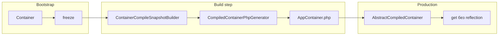

<p align="center">
  
</p>

# ⚡ Compiled container

> [← Главная](Home) · [Bootstrap](Bootstrap) · [API](API-reference#compiled-container-v19)

**Compiled container** (v1.9.0, [#24](https://github.com/cloudcastle-apps/di/issues/24)) — генерация PHP-класса wiring из **замороженного** runtime-контейнера. На hot path `get()` **нет reflection**: создание сервисов — через `match` и готовые PHP-выражения.

---

## Когда использовать

| Сценарий | Runtime `Container` | Compiled |
|----------|---------------------|----------|
| Разработка, частые правки wiring | ✅ | ❌ |
| Production, сотни/тысячи `get()` | ⚠️ reflection | ✅ |
| CI/deploy с фиксированным графом | ✅ + `freeze()` | ✅ compile в build-step |
| Фабрики `set('id', fn () => …)` | ✅ | ❌ |
| Property / method injection | ✅ | ❌ (только constructor) |

---

## Быстрый пример

```php
<?php

declare(strict_types=1);

use CloudCastle\DI\Compiler\ContainerCompiler;
use CloudCastle\DI\Container;

require __DIR__ . '/vendor/autoload.php';

// 1. Собрать граф в dev / build-скрипте
$container = new Container();
$container->autowire(App\Service\OrderService::class);
$container->bind(LoggerInterface::class, FileLogger::class);
$container->tag(FileLogger::class, 'loggers');
$container->freeze();

// 2. Скомпилировать в PHP-файл
$result = (new ContainerCompiler())->compile(
    $container,
    __DIR__ . '/var/compiled/AppContainer.php',
    AppContainer::class, // FQCN; null → из имени файла
);

// $result->className, $result->outputPath
```

В production подключайте сгенерированный класс:

```php
require __DIR__ . '/var/compiled/AppContainer.php';

/** @var \CloudCastle\DI\Contract\CompiledContainerInterface $container */
$container = new AppContainer();
$order = $container->get(OrderService::class);
```

---

## Поток компиляции



---

## Что поддерживается

| Возможность | Поддержка |
|-------------|-----------|
| `set($id, scalar / array / null)` | ✅ Literal |
| `set($id, new Foo())` без параметров конструктора | ✅ NewInstance |
| `autowire(FQCN)` — constructor autowiring | ✅ Autowired |
| `bind()` + `autowire()` | ✅ |
| `alias()` | ✅ |
| `tag()`, `getTagged*()` | ✅ (теги в snapshot) |
| Attributes `Inject` / `Autowire` на **параметрах конструктора** | ✅ |
| Autowiring по имени параметра (`enableParameterNameAutowiring`) | ✅ |
| Union / intersection в конструкторе | ✅ (как в runtime) |
| `get()`, `has()`, `make()`, `call()` | ✅ (compiled immutable + frozen) |
| `dump()`, `getDefinitionIds()` | ✅ |

---

## Ограничения

Компилятор бросает `ContainerCompileException`, если:

| Условие | Причина |
|---------|---------|
| Контейнер не `freeze()` | Снимок должен быть стабильным |
| `set('id', fn (): …)` — callable-фабрика | Нет runtime-вызова фабрик |
| `enableAutowiring()` (глобальный autowiring) | Только явный `autowire()` по классам |
| `enablePropertyAutowiring()` / `enableMethodAutowiring()` | Только constructor injection |
| `decorate()` | Декораторы не в snapshot |
| `afterResolving()` | Hooks не переносятся |
| Property / method attributes inject | Только constructor |
| `set($id, new Foo($dep))` — объект с аргументами конструктора | Используйте `autowire()` |

**Contextual binding** ([#25](https://github.com/cloudcastle-apps/di/issues/25)) в compiled-контейнере **не** поддерживается.

---

## API компилятора

### `ContainerCompilerInterface::compile()`

```php
public function compile(
    ContainerInterface $container,
    string $outputPath,
    ?string $className = null,
): ContainerCompileResult;
```

| Параметр | Описание |
|----------|----------|
| `$container` | Только `CloudCastle\DI\Container` |
| `$outputPath` | Путь к `.php`; каталог создаётся при необходимости |
| `$className` | FQCN; при `null` — `CloudCastle\DI\Compiled\{Basename}` |

### Результат — `ContainerCompileResult`

| Поле | Тип | Описание |
|------|-----|----------|
| `className` | `string` | FQCN сгенерированного класса |
| `outputPath` | `string` | Записанный файл |

### Runtime — `CompiledContainerInterface`

Расширяет `ContainerInterface`, добавляет `getCompiledClassName(): string`. Сгенерированный класс extends `AbstractCompiledContainer` — изменение определений после создания запрещено (`assertImmutable`).

---

## Build-step в CI

```bash
# composer.json scripts (пример)
php tools/compile-container.php
```

```php
<?php
// tools/compile-container.php — пример build-скрипта

declare(strict_types=1);

use CloudCastle\DI\Compiler\ContainerCompiler;
use CloudCastle\DI\Container;

require __DIR__ . '/../vendor/autoload.php';

$container = require __DIR__ . '/../bootstrap/container.php';
(new ContainerCompiler())->compile(
    $container,
    __DIR__ . '/../var/compiled/AppContainer.php',
);
```

Добавьте `var/compiled/` в autoload (composer `classmap` или PSR-4) или `require` в bootstrap.

---

## Parity с runtime

Интеграционные тесты (`CompiledContainerIntegrationTest`) проверяют, что compiled-контейнер даёт **те же экземпляры и теги**, что runtime на момент `freeze()`.

---

## См. также

- [Bootstrap](Bootstrap) — composition root и `freeze()`
- [API-reference](API-reference#compiled-container-v19)
- [Сравнение](Comparison) — compiled vs PHP-DI / Symfony
- [Upgrading](Upgrading) — миграция 1.8 → 1.9
- [Testing](Testing) — `tests/Unit/Compiler/`, `tests/Integration/CompiledContainerIntegrationTest.php`
