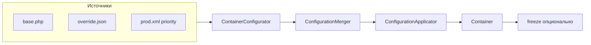
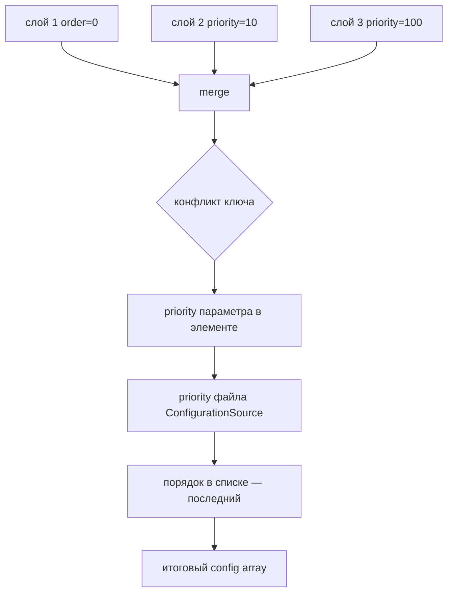

# Конфигурация контейнера

Опциональная загрузка определений из **нескольких файлов** (PHP, JSON, YAML, XML). Реализована отдельным сервисом **`ContainerConfigurator`** — контейнер можно по-прежнему собирать только через PHP API.

**Формат по умолчанию** — PHP (`return [...]`).

## Обзор потока



## Слияние и приоритеты



## Быстрый пример

```php
<?php

use CloudCastle\DI\Configuration\ConfigurationSource;
use CloudCastle\DI\Configuration\ContainerConfigurator;
use CloudCastle\DI\Container;

$container = new Container();
$configurator = new ContainerConfigurator();

$configurator->configure($container, [
    __DIR__ . '/config/base.php',
    __DIR__ . '/config/override.json',
    new ConfigurationSource(__DIR__ . '/config/prod.xml', priority: 100),
]);

$container->freeze();
```

## Приоритеты при слиянии

При конфликте одного и того же параметра:

1. **`priority` у параметра** — `['value' => 'x', 'priority' => 100]` или XML-атрибут `priority` на элементе
2. **Приоритет файла** — `new ConfigurationSource($path, priority: N)` или ключ `priority` в корне конфига
3. **Порядок в списке источников** — без явного приоритета побеждает **последний** файл

## API `ContainerConfigurator`

| Метод | Описание |
|-------|----------|
| `configure(ContainerInterface $container, array $sources): void` | `loadMany()` + `apply()` |
| `loadMany(array $sources): array` | Загрузить и объединить без применения |
| `load(string $path): array` | Один файл |
| `apply(ContainerInterface $container, array $config): void` | Применить уже объединённый массив |

`$sources` — `list<string|ConfigurationSource>`.

## Форматы файлов

| Расширение | Загрузчик | Зависимости |
|------------|-----------|-------------|
| `.php` | `PhpConfigurationLoader` | нет (по умолчанию) |
| `.json` | `JsonConfigurationLoader` | `ext-json` |
| `.yaml`, `.yml` | `YamlConfigurationLoader` | **`ext-yaml`** (`yaml_parse_file`) |
| `.xml` | `XmlConfigurationLoader` | `ext-simplexml` |

Без `ext-yaml` вызов `load()` для `.yaml` бросает `ContainerException` с подсказкой установить расширение.

PHP-конфиг может содержать **callable** (фабрики в `services`). JSON, YAML и XML — только декларативные данные.

## Секции конфигурации

Общая схема для PHP / JSON / YAML:

```php
return [
    'priority' => 10,              // приоритет всего файла (опционально)
    'register_attributes' => [     // пользовательские ServiceIdAttribute
        My\InjectAttribute::class,
    ],
    'autowiring' => [
        'enabled' => true,
        'parameter_name' => true,
        'property' => true,
        'method' => true,
    ],
    'scan' => [
        ['directory' => '/path/to/src', 'namespace' => 'App\\'],
    ],
    'services' => [
        'app.env' => 'prod',
        'logger' => ['class' => FileLogger::class, 'lazy' => true],
        'key' => ['value' => 'x', 'priority' => 100],
    ],
    'autowire' => [SomeClass::class],
    'bind' => [LoggerInterface::class => FileLogger::class],
    'aliases' => ['env' => 'app.env'],
    'tags' => ['handlers' => ['handler.email', 'handler.sms']],
];
```

### `services`

- Скаляр или массив — `set($id, $value)`
- `['class' => FQCN, 'lazy' => true]` — `set($id, $container->lazy(FQCN))`
- `id === class` — `autowire(FQCN)`; иначе — `bind($id, FQCN)`

### Порядок применения

`register_attributes` → `autowiring` → `scan` → `services` → `autowire` → `bind` → `aliases` → `tags`

## XML

Корневой элемент `<container priority="…">`. Секции: `<services>`, `<aliases>`, `<bind>`, `<autowire>`, `<tags>`, `<scan>`, `<register_attributes>`, `<autowiring>`.

Пример сервиса с классом и lazy:

```xml
<service id="logger" class="App\FileLogger" lazy="true"/>
```

Параметр с приоритетом:

```xml
<service id="app.label" priority="100">from-xml</service>
```

Autowire по имени класса в атрибуте:

```xml
<autowire>
    <class name="App\Services\Clock"/>
</autowire>
```

## Расширение загрузчиков

Передайте свой список в конструктор:

```php
new ContainerConfigurator(
    loaderRegistry: new ConfigurationLoaderRegistry([
        new PhpConfigurationLoader(),
        new JsonConfigurationLoader(),
        // …
    ]),
);
```

Реализуйте `CloudCastle\DI\Contract\ConfigurationLoaderInterface`.

## Связь с `freeze()`

После `freeze()` вызов `configure()` / `apply()` приведёт к `ContainerException` при попытке изменить определения (как и прямые `set()` / `bind()`).

Рекомендуемый порядок: `configure()` → `freeze()` в composition root.

## См. также

- [Примеры bootstrap](Bootstrap) — PHP-конфиги и prod `freeze()`
- [Autowiring](Autowiring) — `register_attributes` и пользовательские attributes
- [Справочник API](API-reference) — `ContainerConfigurator`, `registerAttribute()`
