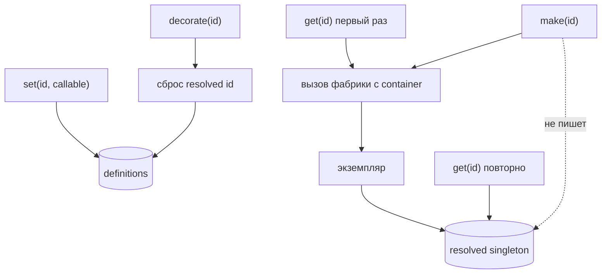

# Фабрики и singleton



## Готовый экземпляр

```php
$container->set('mailer', new Mailer($dsn));
```

## Фабрика (callable)

Если передан `callable`, он вызывается один раз; результат кэшируется до следующего `set()` или `decorate()`:

```php
use CloudCastle\DI\Contract\ContainerInterface;

$container->set(
    'repository',
    static function (ContainerInterface $container): UserRepository {
        return new UserRepository($container->get('pdo'));
    },
);
```

В фабрику передаётся сам контейнер — так строятся цепочки зависимостей.

## Autowiring vs фабрика

| | `set()` + фабрика | autowiring |
|---|-------------------|------------|
| Контроль создания | полный | по конструктору |
| Id | любая строка | обычно FQCN |
| Циклы | не отслеживаются | `ContainerException` |
| Приоритет | выше autowiring | ниже явного `set()` |

Можно комбинировать: scan + явные `set()` для интерфейсов.

## Поддерживаемые callable

- замыкание `fn () => ...` или `function () { ... }`;
- объект с `__invoke`;
- first-class callable `$factory->create(...)`;
- массив `[$object, 'method']` (не путать с data-массивом сервиса).

## Повторная регистрация

`set()` с тем же id **сбрасывает** ранее созданный singleton:

```php
$container->set('token', 'dev');
$container->set('token', 'prod');

$container->get('token'); // 'prod'
```

`autowire(FQCN)` также сбрасывает кэш для этого id.

## Ограничения

### `null` как значение

`set('id', null)` не распознаётся как регистрация из-за `isset()` в PHP.

### Фабрика или autowire, возвращающие `null`

Такой результат **не** кэшируется — при каждом `get()` создание повторяется.

### Циклические зависимости в фабриках

A → B → A через `set()` **не** обнаруживаются автоматически. Возможен бесконечный цикл или переполнение стека.

При **autowiring** циклы обнаруживаются — см. [Autowiring](Autowiring).

## Сравнение `has()` и `hasDefinition()`

```php
$container->set('db', static fn () => new PDO(...));

$container->hasDefinition('db'); // true
$container->has('db');           // true
// get() ещё не вызывался — PDO не создан

$pdo = $container->get('db');
$container->has('db'); // true (definition + resolved)
```

С autowiring:

```php
$container->enableAutowiring();
$container->has(App\Service\UserService::class);           // true
$container->hasDefinition(App\Service\UserService::class); // false

$container->autowire(App\Service\UserService::class);
$container->hasDefinition(App\Service\UserService::class); // true
```

## `make()` — прототип без singleton

```php
$container->set('dto', static fn () => new stdClass());

$a = $container->make('dto');
$b = $container->make('dto'); // новый объект при каждом вызове
```

`make()` не заполняет singleton-кэш; декораторы применяются. Подробнее — [Прототипы, alias и lazy](Prototypes-alias-lazy).

## `alias()` — несколько id на один сервис

```php
$container->set('app.clock', $clock);
$container->alias(ClockInterface::class, 'app.clock');
```

## `lazy()` — отложенное создание

```php
$container->set('heavy', $container->lazy(HeavyService::class));
$lazy = $container->get('heavy');
$service = $lazy->getValue(); // первый get() внутри LazyService
```
