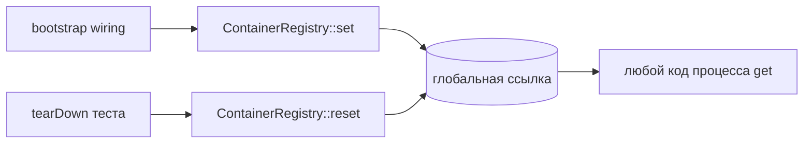

<p align="center">
  
</p>

# 🌍 Глобальный реестр

> [← Главная](Home) · [Сравнение](Comparison) · [Quick start](Quick-start)


`CloudCastle\DI\ContainerRegistry` — статический singleton-реестр **одного** контейнера приложения.



## API

| Метод | Описание |
|-------|----------|
| `ContainerRegistry::set(ContainerInterface $container): void` | Регистрирует глобальный контейнер |
| `ContainerRegistry::get(): ContainerInterface` | Возвращает контейнер |
| `ContainerRegistry::has(): bool` | Был ли вызван `set()` |
| `ContainerRegistry::reset(): void` | Сбрасывает реестр (для тестов) |

## Bootstrap приложения

```php
<?php

declare(strict_types=1);

use CloudCastle\DI\Container;
use CloudCastle\DI\ContainerRegistry;

require 'vendor/autoload.php';

$container = new Container();
$container->enableAutowiring();
$container->scan(__DIR__ . '/Services', 'App\\Services\\');
$container->set(Psr\Log\LoggerInterface::class, createLogger());

ContainerRegistry::set($container);

// Точка входа
runApplication();
```

Доступ из любого места процесса:

```php
use CloudCastle\DI\ContainerRegistry;

final class SomeController
{
    public function handle(): void
    {
        $orders = ContainerRegistry::get()->get(OrderService::class);
        // ...
    }
}
```

## Ошибка до инициализации

```php
ContainerRegistry::get();
// ContainerException: Глобальный контейнер не инициализирован. Вызовите ContainerRegistry::set().
```

Проверка без исключения:

```php
if (ContainerRegistry::has()) {
    $container = ContainerRegistry::get();
}
```

## Тестирование

В каждом тесте (или в `tearDown`) сбрасывайте реестр, чтобы не утекало состояние между кейсами:

```php
protected function tearDown(): void
{
    ContainerRegistry::reset();
    parent::tearDown();
}

public function testSomething(): void
{
    $container = new Container();
    $container->set('clock', new FixedClock());
    ContainerRegistry::set($container);

    // ...
}
```

**Предпочтительнее** в unit-тестах передавать `Container` явно в конструктор — без глобального реестра. Реестр удобен в legacy-коде и точке входа CLI/HTTP.

## Повторный `set()`

Каждый вызов `set()` **заменяет** предыдущий контейнер. Старые ссылки на старый `Container` остаются валидными, но `ContainerRegistry::get()` вернёт новый экземпляр.

## Рекомендации

| Подход | Когда |
|--------|-------|
| Явная передача `ContainerInterface` | новый код, unit-тесты, библиотеки |
| `ContainerRegistry` | bootstrap, legacy, procedural entry scripts |
| `ContainerRegistry::reset()` | PHPUnit tearDown, integration suite |

Подробнее о рисках service locator — [Анти-паттерны](Anti-patterns).

## См. также

- [Autowiring](Autowiring)
- [Тестирование](Testing)
