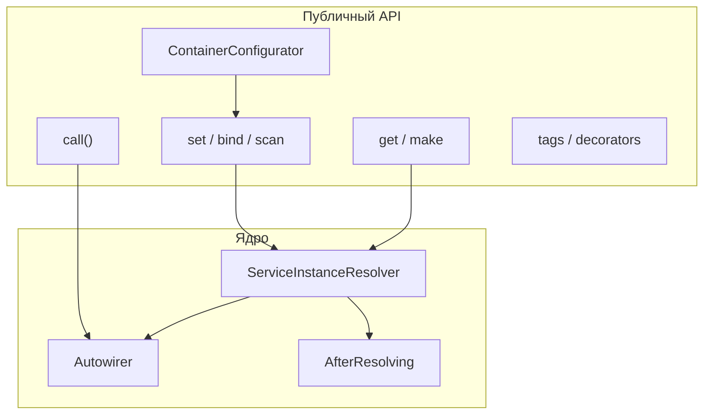

<p align="center">
  
</p>

<p align="center">
  <a href="https://packagist.org/packages/cloudcastle/di"></a>
  <a href="https://packagist.org/packages/cloudcastle/di"></a>
  <a href="https://github.com/cloudcastle-apps/di/actions/workflows/quality.yml"></a>
  <a href="https://packagist.org/packages/cloudcastle/di"></a>
</p>

# CloudCastle DI

**Lightweight PSR-11 dependency injection container for PHP 8.1+**

Лёгкий контейнер внедрения зависимостей с **autowiring**, **декларативной конфигурацией** (PHP / JSON / YAML / XML), **сканированием каталогов**, **тегами**, **декораторами** и расширенным API — при **одной** runtime-зависимости [`psr/container`](https://packagist.org/packages/psr/container).

> 💡 **Для кого:** библиотеки, CLI, API, composition root, тесты — когда Symfony/Laravel избыточны, а Pimple уже мал.

**Текущая версия:** [1.8.0](https://github.com/cloudcastle-apps/di/releases/tag/v1.8.0) · [Packagist](https://packagist.org/packages/cloudcastle/di)

---

## 🚀 Быстрый старт

```bash
composer require cloudcastle/di:^1.8
```

```php
<?php

use CloudCastle\DI\Container;

$container = new Container();
$container->enableAutowiring();
$container->bind(LoggerInterface::class, FileLogger::class);

$service = $container->get(App\Service\OrderService::class);
```

👉 Подробнее — **[Быстрый старт](Quick-start)**

---

## 🧩 Возможности

<table>
<tr>
<td width="50%" valign="top">

### 🔌 Базовый DI
- `set()` / `get()` / `has()` — PSR-11
- Фабрики и singleton-кэш
- `hasDefinition()`, `addDefinitions()`
- `make()` — прототипы без кэша

### 🤖 Autowiring
- Constructor, **property**, **method**
- Attributes `Inject` / `Autowire`
- `registerAttribute()` — свои attributes
- Union, intersection, nullable
- Детекция циклов

### 📂 Сканирование
- `scan($dir, $namespace?)`
- Несколько классов в файле
- Фильтр по namespace

</td>
<td width="50%" valign="top">

### 📄 Конфигурация (v1.5+)
- `ContainerConfigurator`
- PHP, JSON, YAML, XML
- Слои с **priority**
- Каталог / список файлов (v1.7)

### 🏷️ Теги и декораторы
- `tag()`, `getTagged()`, `getTaggedIds()`
- `getTaggedIterator()`, `getTaggedLocator()`
- `decorate()` — цепочки обёрток

### ⚡ Расширения
- `call()`, `bind()`, `afterResolving()`
- `alias()`, `lazy()`, `freeze()`, `dump()`
- `ContainerRegistry` — глобальный реестр

</td>
</tr>
</table>

---

## 📊 Сравнение с аналогами

Единая таблица: **функция → CloudCastle → PHP-DI → Symfony → Pimple → Laravel → Nette → победитель** (5 аналогов).

| | |
|---|---|
| 📋 | **[Сравнение — полная таблица](Comparison)** |
| ⚡ | Одна зависимость `psr/container` |
| 🎯 | Autowiring + конфиг без compiler |
| 🚧 | Compiled container — контракты v2 (#24); contextual — v2 (#25) |

### 🔮 Roadmap v2 (контракты)

- `ContainerCompilerInterface` — компиляция замороженного контейнера в PHP-класс
- `CompiledContainerInterface` — маркер compiled-контейнера без reflection на hot path
- Реализация compiler — [#24](https://github.com/cloudcastle-apps/di/issues/24); contextual binding — [#25](https://github.com/cloudcastle-apps/di/issues/25)

Подробнее — [API-reference](API-reference#v2-compiled-container-контракты), [Upgrading](Upgrading).

---

## 🏗️ Архитектура



Подробные схемы — **[Архитектура](Architecture)**

---

## 📚 Документация

### 🎓 Руководство

| Страница | Описание |
|----------|----------|
| [🏗️ Архитектура](Architecture) | Схемы, потоки resolve, autowiring |
| [⚡ Быстрый старт](Quick-start) | Установка, PSR-11, composition root |
| [📊 Сравнение](Comparison) | Таблица vs 5 аналогов (PHP-DI, Symfony, Pimple, Laravel, Nette) |
| [🤖 Autowiring](Autowiring) | Типы, attributes, циклы, приоритеты |
| [📄 Конфигурация](Configuration) | ContainerConfigurator, форматы, priority |
| [📖 Справочник конфигурации](Configuration-reference) | Все ключи и примеры |
| [📂 Сканирование](Class-scanning) | `scan()`, namespace, ограничения |
| [🏷️ Теги и декораторы](Tags-and-decorators) | tag, iterator, locator, decorate |
| [🔗 call(), bind(), hooks](Call-bind-callbacks) | CallableInvoker, afterResolving |
| [🔄 Прототипы, alias, lazy](Prototypes-alias-lazy) | make, alias, LazyService |
| [🌍 Глобальный реестр](Global-registry) | ContainerRegistry |
| [📋 API](API-reference) | Все методы и исключения |
| [🏭 Фабрики и singleton](Factories-and-singleton) | Callable, кэш, циклы |
| [🧪 Bootstrap](Bootstrap) | Plain PHP, CLI, тесты |

### 🔬 Качество

| Страница | Описание |
|----------|----------|
| [🧪 Тестирование](Testing) | Unit, integration, `composer ci` |
| [🛡️ Security-тесты](Security-tests) | 17 тестов безопасности |
| [📈 Нагрузка и perf](Performance-and-load) | Load, benchmark-check |
| [⚠️ Анти-паттерны](Anti-patterns) | Service locator, глобальный контейнер |

### 📦 Проект

| Страница | Описание |
|----------|----------|
| [⬆️ Обновление версий](Upgrading) | Миграция между релизами |
| [🤝 Contributing](Contributing) | PR, CI, локальная разработка |
| [❓ FAQ](FAQ) | Частые вопросы |

---

## 🔗 Ссылки

- [GitHub](https://github.com/cloudcastle-apps/di) · [Discussions](https://github.com/cloudcastle-apps/di/discussions) · [Issues](https://github.com/cloudcastle-apps/di/issues)
- [README в репозитории](https://github.com/cloudcastle-apps/di/blob/main/README.md)

## 📜 Лицензия

MIT — [LICENSE](https://github.com/cloudcastle-apps/di/blob/main/LICENSE)
