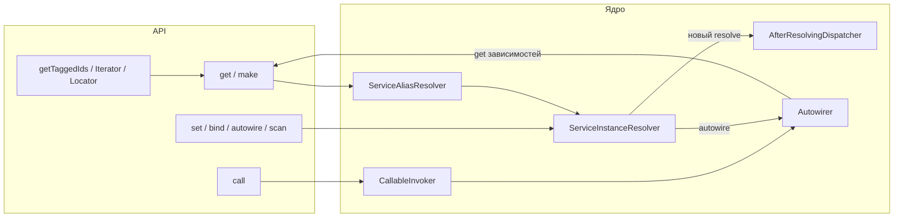

<p align="center">
  
</p>

# CloudCastle DI

**Lightweight PSR-11 dependency injection container for PHP 8.3+** — autowiring, directory scan, tagged services, decorators, `call()` / `bind()`, prototypes, lazy.

Лёгкий контейнер внедрения зависимостей для **PHP 8.3+** с поддержкой [PSR-11](https://www.php-fig.org/psr/psr-11/). Одна runtime-зависимость — `psr/container`.

**Текущая версия:** 1.4.x — см. [Releases](https://github.com/cloudcastle-apps/di/releases) · [Packagist](https://packagist.org/packages/cloudcastle/di)

## Установка

```bash
composer require cloudcastle/di:^1.3
```

Packagist: https://packagist.org/packages/cloudcastle/di

## Сравнение с аналогами (кратко)

| | CloudCastle DI |
|---|----------------|
| **Плюсы** | `psr/container`, PSR-11, autowiring, теги, bootstrap в PHP |
| **Минусы** | нет compiler/contextual (v2), PHP 8.3+ |

**Пошагово** vs PHP-DI, Symfony, Pimple, Laravel — **[Comparison](Comparison)**.

## Возможности

### Регистрация и получение сервисов

- готовые экземпляры и фабрики через `set()`;
- singleton-кэш: фабрика вызывается один раз до следующего `set()`;
- PSR-11: `get()`, `has()`;
- расширенный контракт: `hasDefinition()`, `addDefinitions()`.

### Autowiring

- **`enableAutowiring()`** — любой instantiable-класс доступен по FQCN через `get()`;
- **`autowire(FQCN)`** — точечная регистрация без глобального режима;
- **`enableParameterNameAutowiring()`** — id сервиса = имя параметра (`$logger` → `'logger'`);
- **`enablePropertyAutowiring()`** / **`enableMethodAutowiring()`** — typed properties и inject-методы после конструктора;
- PHP attributes **`Inject`** / **`Autowire`** на конструкторе, **свойствах** и **методах**;
- разрешение зависимостей: типы, union, **intersection**, nullable, `ContainerInterface` / PSR-11;
- обнаружение **циклических зависимостей** при autowiring;
- явный `set()` всегда имеет **приоритет** над autowiring.

### Сканирование каталогов

- **`scan($directory, $namespace?)`** — рекурсивный обход `.php`-файлов;
- парсинг `namespace`, нескольких `class` и `enum` без выполнения файла;
- фильтр по префиксу namespace;
- только instantiable-классы (`enum` пропускаются); существующие `set()` не перезаписываются.

### Прототипы, alias и lazy (v1.2)

- **`make($id)`** — новый экземпляр без singleton-кэша;
- **`alias($alias, $targetId)`** — альтернативный id (цепочки, детекция циклов);
- **`lazy($serviceId)`** — `LazyService` с отложенным `get()`.

### call(), bind(), afterResolving (v1.3)

- **`call($callable, $parameters?)`** — autowiring параметров callable (`CallableInvoker`);
- **`bind($abstract, $concrete)`** — интерфейс → класс (`autowire` + `alias`) или id;
- **`afterResolving($id, $callback)`** — пост-обработка после нового resolve (`AfterResolvingDispatcher`).

### Tagged services и декораторы

- **`tag()` / `getTagged()`** — группы сервисов (порядок = порядок `tag()`);
- **`getTaggedIds()`** — только id, без создания экземпляров;
- **`getTaggedIterator()`** — итерация значений (`TaggedServiceIterator`);
- **`getTaggedLocator()`** — `has` / `get` по id в теге (`TaggedServiceLocator`);
- **`decorate()`** — цепочка обёрток при `get()` / `make()` (первый декоратор ближе к inner).

### Глобальный реестр

- **`ContainerRegistry`** — singleton-контейнер приложения;
- инициализация в bootstrap через `ContainerRegistry::set()`;
- `reset()` для изоляции тестов.

### Качество

PHPStan max, Psalm L1, покрытие строк ≥95%, Infection MSI ≥95%.

## Архитектура (кратко)



Подробные схемы всех потоков — на странице **[Архитектура](Architecture)**.

## Минимальный пример

```php
<?php

use CloudCastle\DI\Container;
use CloudCastle\DI\ContainerRegistry;

$container = new Container();
$container->enableAutowiring();
$container->scan(__DIR__ . '/App/Services', 'App\\Services\\');
$container->bind(LoggerInterface::class, FileLogger::class);

ContainerRegistry::set($container);

$service = ContainerRegistry::get()->get(App\Services\OrderService::class);
```

## Документация

| Страница | Описание |
|----------|----------|
| [Архитектура](Architecture) | схемы контейнера, autowiring, call, afterResolving, теги |
| [Быстрый старт](Quick-start) | установка, PSR-11, composition root |
| [Сравнение с PHP-DI, Symfony, Pimple](Comparison) | пошаговые таблицы, плюсы/минусы, миграция |
| [Примеры bootstrap](Bootstrap) | plain PHP, CLI, unit/integration тесты |
| [Autowiring](Autowiring) | reflection, типы параметров, циклы, приоритеты |
| [Сканирование классов](Class-scanning) | `scan()`, фильтр namespace, ограничения |
| [Глобальный реестр](Global-registry) | `ContainerRegistry`, bootstrap, тесты |
| [Теги и декораторы](Tags-and-decorators) | `tag()`, `getTagged()`, iterator, locator |
| [call(), bind(), afterResolving](Call-bind-callbacks) | v1.3: call, bind, addDefinitions, hooks |
| [Прототипы, alias и lazy](Prototypes-alias-lazy) | `make()`, `alias()`, `lazy()` |
| [Справочник API](API-reference) | все методы и исключения |
| [Фабрики и singleton](Factories-and-singleton) | callable, кэш, `null`, циклы в фабриках |
| [Тестирование](Testing) | unit/integration, моки, `ContainerRegistry::reset()` |
| [Тесты безопасности](Security-tests) | 16 сценариев: кэш, autowire, id, NotFound |
| [Нагрузка и производительность](Performance-and-load) | 15 load + 12 performance, пороги, бенчмарки |
| [Анти-паттерны](Anti-patterns) | service locator, autowiring, глобальный контейнер |
| [Обновление версий](Upgrading) | миграция между релизами |
| [Участие в разработке](Contributing) | `composer ci`, PR |
| [FAQ](FAQ) | частые вопросы |

## Ссылки

- [Репозиторий](https://github.com/cloudcastle-apps/di)
- [Discussions](https://github.com/cloudcastle-apps/di/discussions)
- [Issues](https://github.com/cloudcastle-apps/di/issues)
- [Releases](https://github.com/cloudcastle-apps/di/releases)
- [README в репозитории](https://github.com/cloudcastle-apps/di/blob/main/README.md)

## Лицензия

MIT — см. [LICENSE](https://github.com/cloudcastle-apps/di/blob/main/LICENSE).
