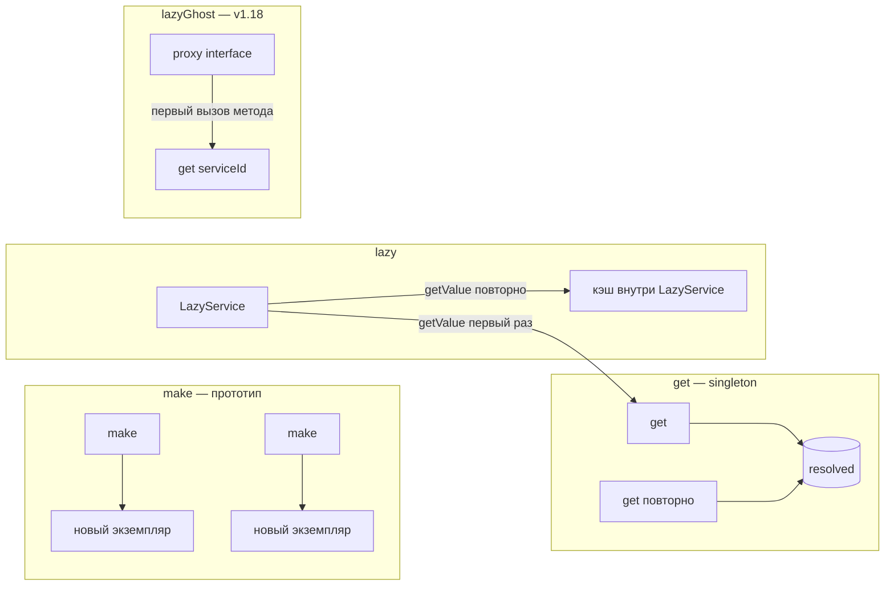

<p align="center">
  
</p>

# 🔄 Прототипы, alias и lazy

> [← Главная](Home) · [Сравнение](Comparison) · [Quick start](Quick-start)


К базовому `get()` / `set()` добавлены дополнения:

> Схемы resolve, alias и lazy — [Архитектура](Architecture#get-и-make-общий-путь-разрешения).

| Метод | Назначение |
|-------|------------|
| `make(string $id)` | новый экземпляр **без** singleton-кэша |
| `alias(string $alias, string $targetId)` | альтернативный id → целевой сервис |
| `lazy(string $serviceId)` | отложенное создание через `LazyService` |
| `lazyGhost(string $type, string $serviceId)` | **v1.18** — ghost/proxy для interface без autoload реализации до первого вызова метода |



## `make()` — прототип вместо singleton

`get()` кэширует результат фабрики или autowiring. `make()` создаёт сервис заново при каждом вызове:

```php
$container->set('dto', static fn () => new stdClass());

$first = $container->make('dto');
$second = $container->make('dto');

// $first !== $second
```

Поведение:

- фабрика вызывается при **каждом** `make()`;
- singleton-кэш (`resolved`) **не** заполняется;
- декораторы применяются так же, как при `get()`;
- alias разрешается перед созданием;
- autowiring и циклы — те же правила, что у `get()`.

Типичные сценарии: DTO на запрос, временные объекты в тестах, stateful-объекты, которые не должны жить в singleton-кэше.

## `alias()` — несколько id на один сервис

```php
$container->set('app.clock', $clock);
$container->alias(ClockInterface::class, 'app.clock');

$container->get(ClockInterface::class); // тот же экземпляр, что get('app.clock')
```

Цепочки alias:

```php
$container->alias('clock.alias', 'app.clock');
$container->alias(ClockInterface::class, 'clock.alias');
```

При регистрации циклической цепочки (`a` → `b` → `a`) выбрасывается `ContainerException`.

`has()` и `hasDefinition()` возвращают `true` для зарегистрированного alias. `getTagged()` разрешает alias у id в теге.

С v1.3.0 для привязки интерфейса к классу удобнее **`bind(Interface::class, Implementation::class)`** — эквивалент `autowire()` + `alias()`. См. [call(), bind(), afterResolving](Call-bind-callbacks).

Внутренняя реализация alias — класс `ServiceAliasResolver`.

## `lazy()` — отложенное создание

```php
$container->set('reports', $container->lazy(ReportGenerator::class));

// ReportGenerator ещё не создан
$lazy = $container->get('reports');
$generator = $lazy->getValue(); // первый get() внутри LazyService
$same = $lazy->getValue();      // тот же экземпляр из кэша LazyService
```

`LazyService::getValue()`:

1. при первом вызове выполняет `$container->get($serviceId)`;
2. кэширует результат внутри обёртки;
3. при повторных вызовах возвращает тот же объект.

Удобно передавать «тяжёлые» зависимости через `set()`, не создавая их до первого использования.

## `lazyGhost()` — ghost/proxy для interface (v1.18.0)

Symfony-style **lazy ghost**: proxy реализует **только interface**, класс реализации **не autoload'ится** до первого вызова метода на proxy.

**Opt-in:** пакет `symfony/var-exporter` не входит в runtime-зависимости контейнера — только в `composer suggest` / dev для тестов.

```bash
composer require symfony/var-exporter
```

```php
$container->set('reports', static fn (): ReportGeneratorInterface => new ReportGenerator());

$proxy = $container->lazyGhost(ReportGeneratorInterface::class, 'reports');
// класс ReportGenerator ещё не загружен

$result = $proxy->generate(); // первый вызов → $container->get('reports')
```

Поведение:

- `$type` — **только** `class-string` interface; для класса — `ContainerException`;
- при первом вызове метода proxy вызывается `$container->get($serviceId)` (с учётом alias);
- реализация через `LazyGhostProxyFactory` + `ProxyHelper::generateLazyProxy()`;
- если `symfony/var-exporter` не установлен — `ContainerException` при вызове `lazyGhost()`;
- тот же API в **`AbstractCompiledContainer`** (compiled runtime).

### `lazy()` vs `lazyGhost()`

| | `lazy()` | `lazyGhost()` |
|---|----------|---------------|
| Возвращает | `LazyService` (обёртка) | объект proxy (interface) |
| Autoload реализации | при `getValue()` | при **первом вызове метода** proxy |
| Тип | любой id сервиса | только interface |
| Зависимость | нет | opt-in `symfony/var-exporter` |
| Типичный use-case | отложить `get()` | не загружать тяжёлый класс до использования API |

## Сравнение `get()` и `make()`

| | `get()` | `make()` |
|---|---------|----------|
| Singleton-кэш | да | нет |
| Фабрика | один раз | каждый вызов |
| Autowiring | кэшируется | новый объект |
| Декораторы | да | да |
| Alias | да | да |

## См. также

- [Фабрики и singleton](Factories-and-singleton)
- [Compiled container](Compiled-container) — `lazyGhost()` в compiled runtime
- [Справочник API](API-reference)
- [Обновление 1.17 → 1.18](Upgrading#1170--1180)
